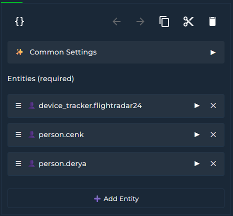
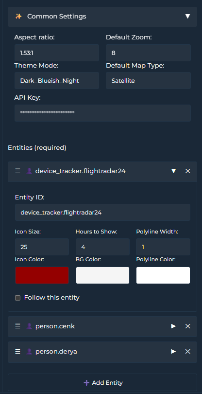
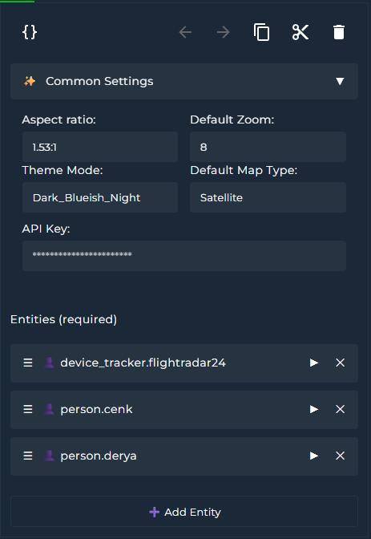

# Google Maps Card for Home Assistant

A simple and responsive Lovelace custom card that displays the location of `person.`, `zone.` or `device_tracker.` entities and tracks their routes using the Google Maps JavaScript API.

<br>

# Features

- Street View  
- Route tracking  
- Themes (40+ built‑in)  
- Interactive Google Map view  
- Dynamic selection of person/zone/device_tracker entities  
- Map terrain types (Map, Satellite, Hybrid, Terrain)  
- Custom zoom level  
- Fully responsive iframe layout with `aspect_ratio`  
- **Show/hide map controls** (Pan, Zoom, Street View, Fullscreen, Map Type, Rotate)  
- **Control positions of buttons**
- **Scale bar** and **keyboard shortcuts** support  
- **Follow** mode: auto‑center map on selected entity/entities  

<br>

# Attention

💡 Google Maps JavaScript API must be enabled in your Google Cloud project:  
https://console.cloud.google.com/google/maps-apis/api-list


💡 Most Google APIs have quotas and exceeding limits may incur charges.  
Google Maps JavaScript API itself has no daily limit, but watch your monthly quota.

Create API key and click the “Show key” button in the console:


---

<br>

# Installation

## Via HACS (Recommended)

1. Go to **HACS**  
2. Search for **Google Map Card**  
3. Download & install  

## Manual

1. Download `google-map-card.js` and `themes.js`  
2. Place them in `www/community/google-map-card/`  
3. Add to your Lovelace **resources**:

    ```yaml
    resources:
      - url: /local/community/google-map-card/google-map-card.js
        type: module
    ```

<br>

# Adding the Card to Dashboard

Add via the Lovelace card picker (search “Google Map Card”)  
or define it in YAML (see Card Example below):

<br>


<br>

# Parameters

| Key                            | Type      | Description                                                                                                                   |
|--------------------------------|-----------|-------------------------------------------------------------------------------------------------------------------------------|
| `api_key`                      | string    | Your Google Maps Embed API key (required)                                                                                     |
| `entities`                     | list      | One or more `person.`, `zone.`, or `device_tracker.` entities (required)                                                      |
| `zoom`                         | integer   | Zoom level (1–20) (optional, default: 11)                                                                                     |
| `theme_mode`                   | string    | Choose from built‑in theme list in UI editor (optional)                                                                       |
| `aspect_ratio`                 | string    | Card aspect ratio, e.g. `16:9`, `4:3`, `0.75`, `400px` (optional)                                                              |
| `map_type`                     | string    | Map style: `Map` (roadmap), `Satellite`, `Hybrid`, `Terrain` (default: `Map`)                                                |
| `icon_size`                    | integer   | Default icon size for all entities (optional)                                                                                 |
| `icon_color`                   | string    | Default icon color (optional)                                                                                                 |
| `background_color`             | string    | Default icon background color (optional)                                                                                       |
| `hours_to_show`                | integer   | Enables route tracking: N hours of history (0 = disable, default: 0)                                                          |
| `polyline_color`               | string    | Polyline color for route history (optional)                                                                                   |
| `polyline_width`               | integer   | Polyline width for route history (optional)                                                                                   |
| `follow`                       | boolean   | Center map on this entity after update; if multiple entities have `follow: true`, map bounds adjust to include all (default: false) |
| **Map Controls**:               |           | **Toggle visibility & position**                                                                                              |
| `panControl`                   | boolean   | Show/hide pan control (default: true)                                                                                         |
| `zoomControl`                  | boolean   | Show/hide zoom control (default: true)                                                                                        |
| `streetViewControl`            | boolean   | Show/hide Street View control (default: true)                                                                                 |
| `fullscreenControl`            | boolean   | Show/hide fullscreen control (default: true)                                                                                   |
| `mapTypeControl`               | boolean   | Show/hide map type selector (default: true)                                                                                    |
| `rotateControl`                | boolean   | Show/hide tilt/rotate control (default: true)                                                                                  |
| `showScale`                    | boolean   | Show/hide scale bar (default: true)                                                                                           |
| `keyboardShortcuts`            | boolean   | Enable/disable keyboard navigation (default: true)                                                                             |
| **Control Positions**:          |           | Use `<control>_position` to set each control’s placement (see below)                                                          |
| `panControl_position`          | string    | Position for pan control (e.g. `RIGHT_BOTTOM`)                                                                                 |
| `zoomControl_position`         | string    | Position for zoom control (e.g. `RIGHT_BOTTOM`)                                                                                |
| `streetViewControl_position`   | string    | Position for Street View control (e.g. `LEFT_BOTTOM`)                                                                          |
| `fullscreenControl_position`   | string    | Position for fullscreen control (e.g. `TOP_RIGHT`)                                                                             |
| `mapTypeControl_position`      | string    | Position for map type selector (e.g. `TOP_LEFT`)                                                                               |
| `rotateControl_position`       | string    | Position for rotate control (e.g. `LEFT_BOTTOM`)                                                                               |

**The following control positions are supported:** 

`TOP_LEFT`, `TOP_CENTER`, `TOP_RIGHT`,  
`LEFT_TOP`, `LEFT_CENTER`, `LEFT_BOTTOM`,  
`RIGHT_TOP`, `RIGHT_CENTER`, `RIGHT_BOTTOM`,  
`BOTTOM_LEFT`, `BOTTOM_CENTER`, `BOTTOM_RIGHT`

| Position         | Description                                                                                                           |
|------------------|-----------------------------------------------------------------------------------------------------------------------|
| `TOP_CENTER`     | Control placed along the top center of the map.                                                                       |
| `TOP_LEFT`       | Control placed along the top left of the map, with sub‑elements “flowing” toward the top center.                      |
| `TOP_RIGHT`      | Control placed along the top right of the map, with sub‑elements “flowing” toward the top center.                     |
| `LEFT_TOP`       | Control placed along the top left of the map, but below any `TOP_LEFT` elements.                                      |
| `RIGHT_TOP`      | Control placed along the top right of the map, but below any `TOP_RIGHT` elements.                                    |
| `LEFT_CENTER`    | Control placed along the left side of the map, centered between `TOP_LEFT` and `BOTTOM_LEFT`.                         |
| `RIGHT_CENTER`   | Control placed along the right side of the map, centered between `TOP_RIGHT` and `BOTTOM_RIGHT`.                      |
| `LEFT_BOTTOM`    | Control placed along the bottom left of the map, but above any `BOTTOM_LEFT` elements.                                |
| `RIGHT_BOTTOM`   | Control placed along the bottom right of the map, but above any `BOTTOM_RIGHT` elements.                              |
| `BOTTOM_CENTER`  | Control placed along the bottom center of the map.                                                                    |
| `BOTTOM_LEFT`    | Control placed along the bottom left of the map, with sub‑elements “flowing” toward the bottom center.                |
| `BOTTOM_RIGHT`   | Control placed along the bottom right of the map, with sub‑elements “flowing” toward the bottom center.               |


<br>

# UI Card Editor

  
   
<br>

# Themes

You can choose your best theme—40 now and more to come!  
  


<br>

# Card Example

```yaml
type: custom:google-map-card
api_key: 123457adasd56a4d78ad
entities:
  - entity: person.animal
    polyline_color: "#FF0000"
    polyline_width: 2
    icon_size: 15
    hours_to_show: 2
    icon_color: white
    background_color: darkblue
    follow: false
  - entity: zone.home
    polyline_color: "#0000FF"
    polyline_width: 1
    icon_size: 20
    hours_to_show: 3
    icon_color: white
    background_color: green
    follow: true
  - entity: device_tracker.androidphone
    icon_size: 15
    hours_to_show: 0
    icon_color: white
    background_color: green
    follow: false
zoom: 11
theme_mode: Dark_Blueish_Night
panControl: true
panControl_position: RIGHT_BOTTOM
zoomControl: true
zoomControl_position: RIGHT_BOTTOM
streetViewControl: true
streetViewControl_position: LEFT_BOTTOM
fullscreenControl: true
fullscreenControl_position: TOP_RIGHT
mapTypeControl: true
mapTypeControl_position: TOP_LEFT
rotateControl: true
rotateControl_position: LEFT_BOTTOM
showScale: true
keyboardShortcuts: true
```

# Screenshots

  
  

