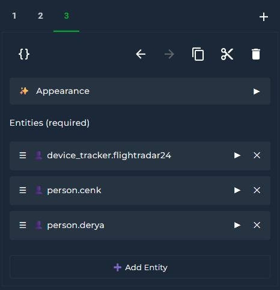
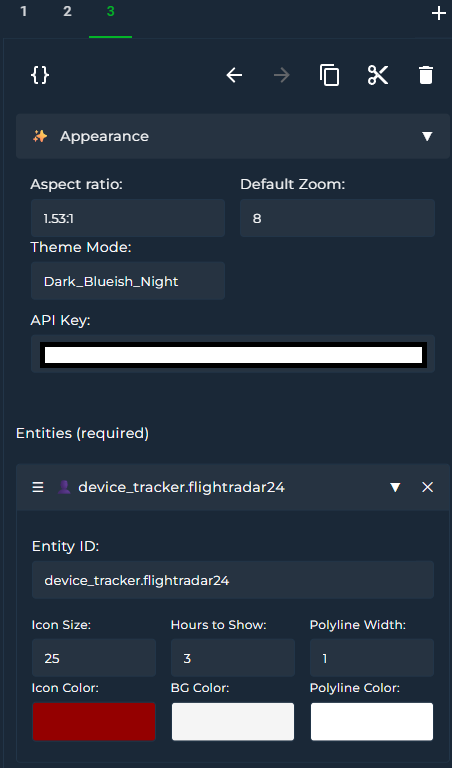

# Google Map Card for Home Assistant

A simple and responsive Lovelace custom card that displays the location of a `person.` `zone.` or `device_tracker.` entities and track their routes using the Google Maps JavaScript API

<br>

# Features

- Street View
- Route tracking
- Themes
- Interactive Google Map view
- Dynamic selection of person entities
- Map terrain types
- Custom zoom level
- Fully responsive iframe layout

<br>

# Attention

💡 Google Maps JavaScript API must be enabled in your Google Cloud project. https://console.cloud.google.com/google/maps-apis/api-list


💡 Most of the Google API's have quotas and exceeding limits are charged by Google. However Google Maps JavaScript API is unlimited per day. But to stay on the safe side do not forget to check your monthly quota limits. (not only for this integration but also the others related to Google API's)

Create API and click the show key button on the bottom right


---

<br>

# Installation

## Via HACS (Recommended)

1. Go to **HACS**
2. Search for Google Map Card
3. Download

## Manual

1. Download `google-map-card.js` and `themes.js`
2. Place them in `www/community/google-map-card/`
3. Add the following to your Lovelace `resources:`

```yaml
resources:   
  url: /local/community/google-map-card/google-map-card.js
```

<br>

# Adding the Card to Dashboard
You can search it on card picker or you can use yaml code (Please see Card Example section)

<br>


# Parameters

| Key               | Type     | Description                                                                 |
|-------------------|----------|-----------------------------------------------------------------------------|
| `api_key`         | string   | Your Google Maps Embed API key (required)                                  |
| `entities`        | list     | One or more `person.` `zone.` or `device_tracker.` entities (required)     |
| `zoom`            | integer  | Zoom level (1–20) (optional)                                                |
| `theme_mode`      | string   | You can see list on UI editor's dropdown menu (optional)                   |
| `aspect_ratio`    | string   | Adjust card size (optional)                                                |
| `icon_size`       | integer  | (optional)                                                                 |
| `hours_to_show`   | integer  | Enables route tracking. 0 to disable it, default: 0                         |
| `polyline_color`  | string   | Polyline color for tracking                                                |
| `polyline_width`  | integer  | Polyline width for tracking                                                |
| `icon_color`      | string   | Icon color                                                                 |
| `background_color`| string   | Icon background color                                                      |

<br>

# UI Card Editor

  


<br>

# Themes

You can choose your best theme. So many options ;) 40 now and more to come in the future  
  


<br>

# Card Example

```yaml
type: custom:google-map-card
api_key: 123457adasd56a4d78ad
entities:
  - entity: person.animal
    polyline_color: "#FF0000"
    polyline_width: 2
    icon_size: 15
    hours_to_show: 2
    icon_color: white
    background_color: darkblue
  - entity: zone.home
    polyline_color: "#0000FF"
    polyline_width: 1
    icon_size: 20
    hours_to_show: 3
    icon_color: white
    background_color: green
  - entity: device_tracker.androidphone
    icon_size: 15
    hours_to_show: 0
    icon_color: white
    background_color: green
zoom: 11
theme_mode: Dark_Blueish_Night
```

<br>

# Screenshots

  
  

