<a href="https://www.buymeacoffee.com/cataseven" target="_blank">
  
</a>

# Google Maps Card for Home Assistant


[](https://github.com/hacs/frontend)
[](https://github.com/cataseven/Google-Map-Card/releases)
[](LICENSE)


[](https://github.com/cataseven/Google-Map-Card)
[](https://github.com/cataseven/Google-Map-Card/issues)

#### Responsive Lovelace custom Google Maps card that displays the location of `person.`, `device_tracker.`, and `sensor.` entities and tracks their routes using the Google Maps JavaScript API including Live Traffic, Street View, POI Filtering, Map Types, FlightRadar24 Integration and **Route Search and Travel Time Calculator** support

---

# Features

* **Route Search and Travel Time Calculator** 🆕
  * **NEW (v5.0.2): Map-based route info bar, clickable route polylines, fullscreen panel overlay, active shortcut highlighting, and theme-consistent button colors**
  * **v5.0.0: Docked travel panel with real-time route calculation, live traffic-colored polylines, address autocomplete, route shortcuts, and multi-modal support (driving/walking/transit/cycling)**
* Live Traffic Info
* Weather Layers (via OpenWeather API Key) with adjustable opacity, brightness, contrast and saturation
* **FlightRadar24 integration support**
  * **NEW (v4.0.0): Dedicated FlightRadar panel + airport arrivals/departures table + Add/Remove Flight directly on the map via right click button**
* Create Zone, Edit Zone, Delete Zone directly from the card (right click / long press)
* Show Zones
* POI Filtering
* Street View
* Route tracking (polylines + history dots)
* Themes (40+ built‑in)
* Interactive Google Map view
* Dynamic selection of person/zone/device_tracker entities
* Geo Location sources auto-listing (from HA geo integrations)
* Map terrain types (Map, Satellite, Hybrid, Terrain)
* Custom zoom level
* Fully responsive iframe layout with `aspect_ratio`
* **Show/hide map controls** (Pan, Zoom, Street View, Fullscreen, Map Type, Rotate)
* **Control positions of buttons**
* **Scale bar** and **keyboard shortcuts** support
* **Follow** mode: auto‑center map on selected entity/entities
* **Marker clustering** (history dots) for performance on slower systems
* **Proximity clustering** (entities grouped within a radius until zoom >= 17)
* **Spiderfy / overlap separation** (high zoom) for entities with the exact same location
* **GPS Accuracy visualization**
  * Accuracy styling via `gps_accuracy_ranges`
  * **NEW (v4.0.0): optional GPS accuracy radius line + label** per entity
* **External Date Control** 🆕 (v5.0.9)
  * Bind history date range to Home Assistant `input_datetime` entities — single day or explicit start/end range
  * Multiple cards stay in sync, perfect for tracking dashboards with markdown logs
* **Map & Format Language** 🆕 (v5.0.9)
  * Choose map labels and date/number formatting independently from your HA profile language
* **Dynamic Zoom** 🆕 (v5.0.10)
  * The `zoom` field now accepts a Home Assistant entity (`input_number`, `sensor`) for real-time zoom control
* **History Dot Shapes** 🆕 (v5.0.10)
  * Per-entity dot customization: circle, square, triangle, diamond, star, pentagon — filled or outline
  * Dot size auto-scales with polyline width, or can be set manually

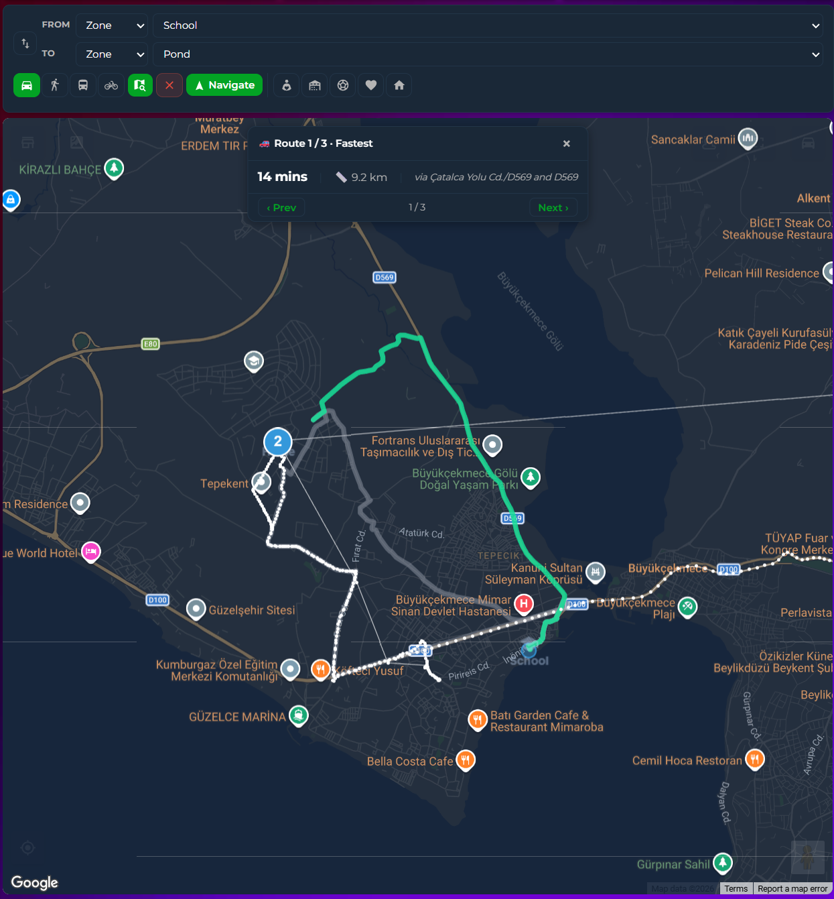 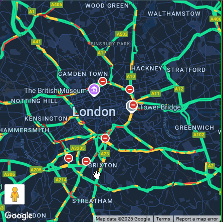 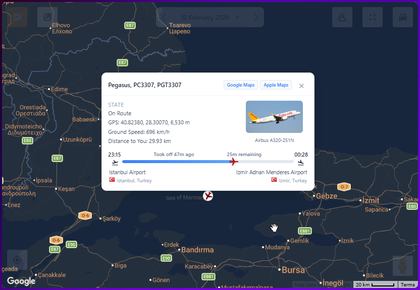 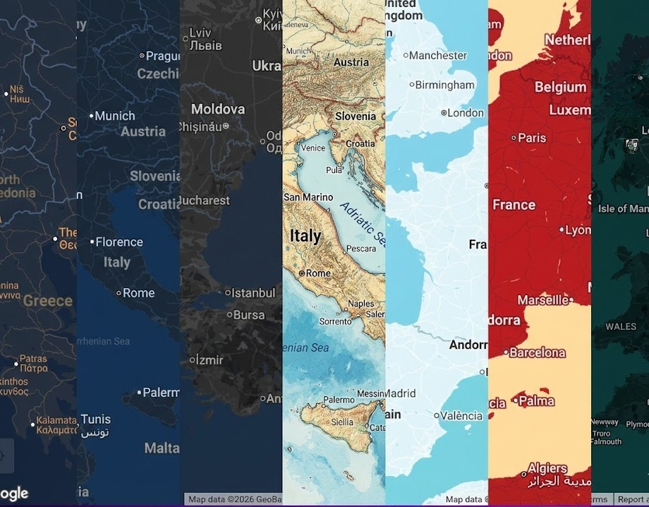 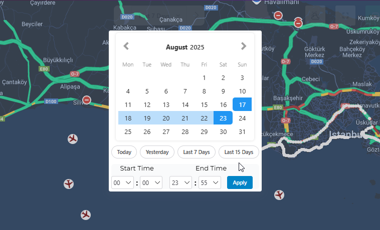 <br>

# Attention

💡 Google Maps JavaScript API must be enabled in your Google Cloud project:
[https://console.cloud.google.com/google/maps-apis/api-list](https://console.cloud.google.com/google/maps-apis/api-list)

If you plan to use the **Route Search and Travel Time Calculator**, you also need to enable these additional APIs:

| API | Purpose | Required for |
|-----|---------|-------------|
| **Maps JavaScript API** | Core map rendering | All features (required) |
| **Directions API** | Route calculation, alternatives, duration & distance | Route Search and Travel Time Calculator |
| **Places API (New)** | Address autocomplete in travel panel | Route Search and Travel Time Calculator |
| **Routes API** | Real-time traffic segment data for color-coded polylines | Route Search and Travel Time Calculator |

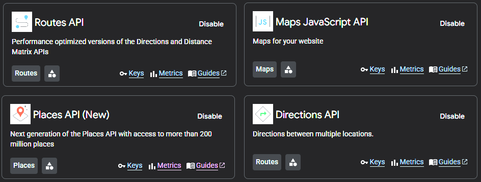

---

# 💰 API Pricing & Free Quotas — You're Probably Fine

Google Maps Platform follows a "Pay-as-you-go" model, but don't let that scare you — **Google provides a very generous free tier that comfortably covers typical Home Assistant usage.** Most home users will never come close to the limits.

Here's how much you get for free every month (as of March 2025):

| Feature | Required API | Free Monthly Limit | What That Means for You |
| :--- | :--- | :--- | :--- |
| **Core Map Rendering** | Maps JavaScript API (Dynamic Maps) | **10,000** map loads | ~330 map loads/day — plenty for a household dashboard |
| **Route Calculation** | Directions API | **10,000** requests | ~330 routes/day — way more than daily commute checks |
| **Address Autocomplete** | Places API (New) | **10,000** requests | ~330 autocomplete sessions/day |
| **Live Traffic Routes** | Routes API | **5,000 – 10,000** requests | More than enough for regular route queries |

To put this in perspective: if you open your HA dashboard 10 times a day and calculate 5 routes, that's still only ~450 map loads and ~150 API calls in a month — **well under 5% of your free quota.** You'd need to be loading the map hundreds of times daily to even approach the limits.

> 💡 **In short:** For personal / household use, the free tier is more than enough. You won't pay a cent unless you do something unusual.

To use all features of this card (including the Route Calculator), you need to enable the required APIs in your Google Cloud project: [API List](https://console.cloud.google.com/google/maps-apis/api-list)

### ❓ Why does my Quotas page say "Unlimited"?

If you check your Google Cloud Quotas page, you might see **"Unlimited"** next to *Map loads per day*. This doesn't mean you'll be charged without warning — it just means Google won't technically block your requests if traffic spikes. Billing only kicks in after the **10,000 monthly free loads**, and for a typical home setup you'll stay well within that.

That said, if you want extra peace of mind (always a good idea!), you can set a daily cap yourself:

### 🛡️ Optional Safety Steps (Recommended)

These are simple one-time steps to make sure you're fully protected — they only take a minute:

1. **Set a daily quota cap** — Go to **APIs & Services → Quotas** and lower the "Unlimited" daily limit to something comfortable (e.g., 200/day). This creates a hard ceiling so you can never accidentally exceed the free tier.
2. **Create a budget alert** — Go to **Billing → Budgets & Alerts** and set a $1–2/month alert. Google will email you if costs approach your threshold. Think of it as a smoke detector — you'll probably never hear it, but it's nice to have.
3. **Restrict your API key** — Limit it to only the APIs you actually use.

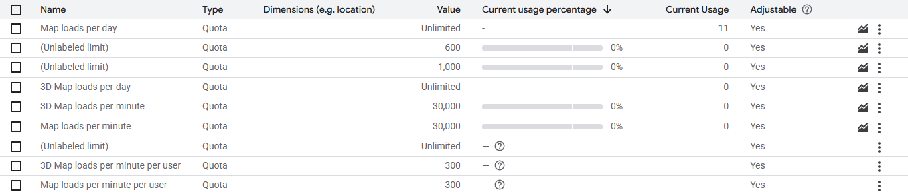

You can always check your actual usage here: [Google Maps API Quotas](https://console.cloud.google.com/google/maps-apis/quotas)

For a great walkthrough on setting up your API key safely, check out this video by @BeardedTinker:
[https://youtu.be/usGLOxtXCxA?si=BxDj65bksi_tcZek](https://youtu.be/usGLOxtXCxA?si=BxDj65bksi_tcZek)

### 🚗 Route Calculator — Built-in Safety Net

Each route calculation triggers multiple API calls behind the scenes (Directions + Routes + Places autocomplete), so 50 route calculations could mean ~150+ total API calls. To keep things safe by default, **this card has a built-in soft limit of 50 route calculations per day per API key** (shared across all browser instances). That's still plenty for daily use — you'd have to actively try to hit it.

> 💡 For the best protection, combine this built-in limit with a hard daily quota in your Google Cloud Console (see the safety steps above). Belt and suspenders!

Create your API key and click the “Show key” button in the console:

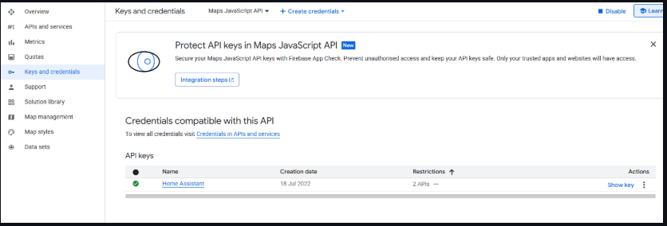

---

<br>>

# Installation

## Via HACS

1. Go to **HACS**
2. Search for **Google Map Card**
3. Download & install

---

# Adding the Card to Dashboard

Add via the Lovelace card picker (search “Google Map Card”)
or define it in YAML (see Card Example below):

<br>

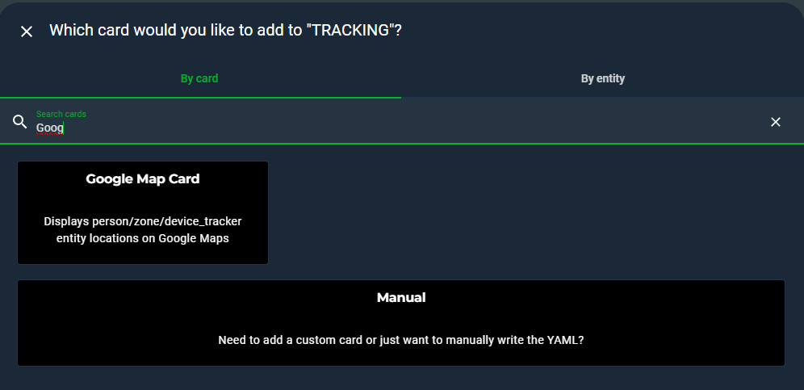

<br>

## 📐 Dashboard Layout Tips

### Standard Dashboard (Masonry / Panel)

Use `aspect_ratio` to control the card height:

```yaml
type: custom:google-map-card
api_key: YOUR_API_KEY
aspect_ratio: "16:9"   # or 4:3, 1:1, 400px, etc.
```

### Sections Dashboard

If you are using Home Assistant’s **Sections** dashboard layout, the recommended approach is to use `aspect_ratio`** and rows: auto

```yaml
type: custom:google-map-card
api_key: YOUR_API_KEY
grid_options:
  columns: full
  rows: auto
```

With `rows: auto` the card height is determined by `aspect_ratio`

> 💡 **Tip:** Leaving `aspect_ratio` empty without setting `grid_options: columns: full` may cause the card to render with zero height on some Sections layouts. Always use one approach or the other.


### Panel Layout

If you are using Home Assistant’s **Panel** dashboard layout, the recommended approach is to leave `aspect_ratio`* empty

<br>

# UI Card Editor

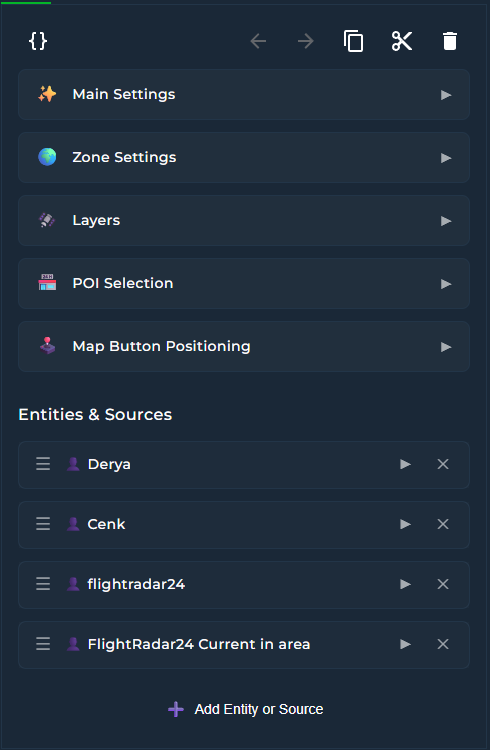 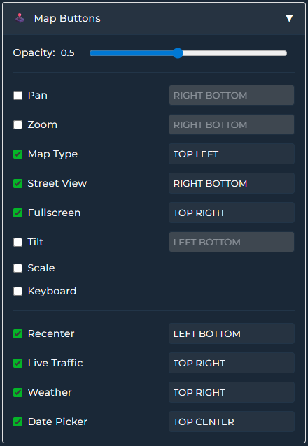 

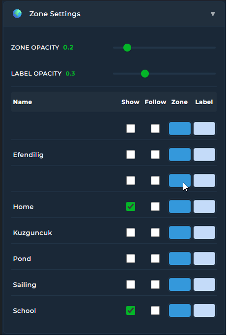 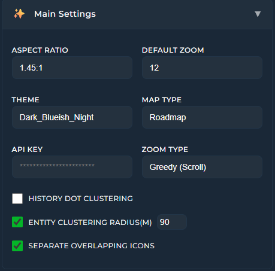

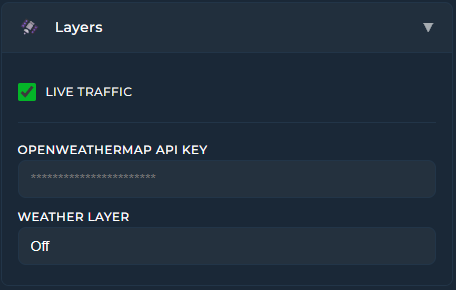 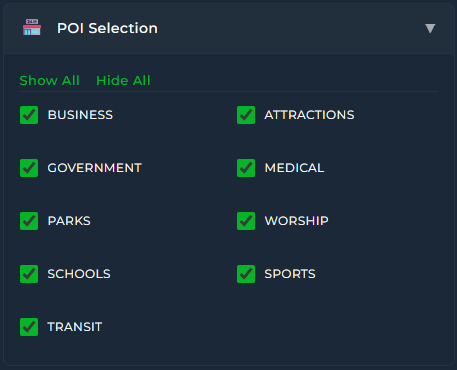

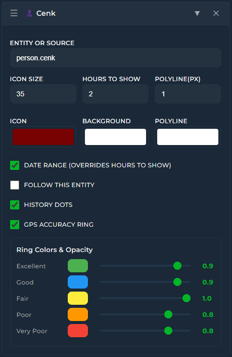 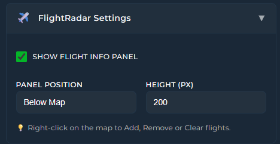

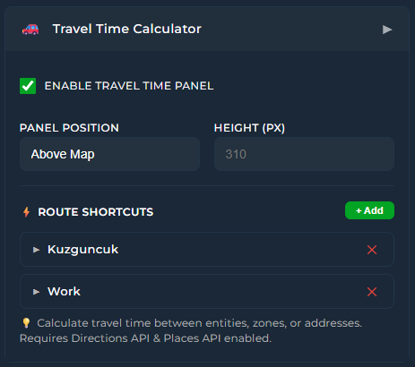

---

# 🚗 Route Search and Travel Time Calculator (v5.0.4)

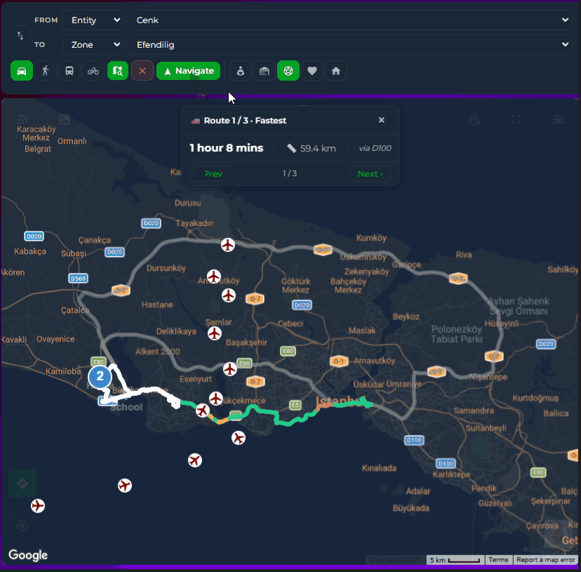

Calculate real-time travel times between any combination of **entities**, **zones**, or **typed addresses** — directly from your dashboard. The panel supports driving, walking, transit, and cycling modes with **live traffic visualization** on the map.

## What you get

* **Docked travel panel** with flexible positioning (above / below the map)
* **Map-based route info bar** — after calculating, a compact bar appears at the top of the map showing travel time, distance, and route name. No list, no clutter.
* **Multi-modal routing** — Driving 🚗, Walking 🚶, Transit 🚌, Cycling 🚴
* **Live traffic-colored routes** for driving mode:
  * 🟢 Green — Normal flow
  * 🟡 Yellow — Slow traffic
  * 🔴 Red — Heavy traffic / Traffic jam
* **Alternative routes** — click any route line on the map or use Prev / Next in the info bar to switch between options
* **Address autocomplete** — powered by Places API (New) with instant suggestions
* **Route Shortcuts** ⚡ — define frequently used routes with custom icons and labels for one-tap calculation
  * Selected shortcut is highlighted so you always know which one is active
  * Supports `person`, `device_tracker`, and `zone` entities
  * Collapsible editor with label-based headers
* **Toggle button** on the map to show/hide the panel — optional, position configurable in Map Button Positioning. Panel opens automatically on first load.
* **Fullscreen support** — the panel and route info bar stay visible in fullscreen mode, anchored to the bottom of the screen

### Required APIs

The Route Search and Travel Time Calculator requires these additional APIs to be enabled in [Google Cloud Console](https://console.cloud.google.com/apis/library):

* **Directions API** — Route calculation
* **Places API (New)** — Address autocomplete
* **Routes API** — Traffic segment data


# 🌍 Map & Format Language

By default, the card uses your Home Assistant profile language for map labels (city names, streets) and in-card date/number formatting. If you'd like the map to display in a different language — for example, you run HA in English but want city names in your native script (Cyrillic, Japanese, Arabic, etc.) — set the `language` option.

```yaml
type: custom:google-map-card
api_key: YOUR_API_KEY
language: ja          # BCP-47 tag: en, tr, de, ja, ru, he, ar, etc.
entities:
  - person.alice
```

You can also pick the language from the visual editor's **Map Language** dropdown.

> ⚠️ Google Maps reads the language only at script load time. After changing this setting, do a full page reload (Ctrl+Shift+R) for map labels to update.

Leave the option empty (or omit it) to fall back to your Home Assistant profile language.

---

# 📅 External Date Control

You can bind the card's history date range to one or more Home Assistant `input_datetime` entities. This lets a single date picker on your dashboard drive both the map and other cards (markdown logs, tables, statistics) at the same time — no more selecting the date twice.

## Two modes

**Single day** — one entity, automatically expanded to that day's full 00:00–23:59 range:

```yaml
type: custom:google-map-card
api_key: YOUR_API_KEY
history_date_entity: input_datetime.map_date
entities:
  - person.alice
  - person.bob
```

**Date range** — explicit start and end (each with optional time):

```yaml
type: custom:google-map-card
api_key: YOUR_API_KEY
history_start_entity: input_datetime.history_start
history_end_entity: input_datetime.history_end
entities:
  - person.alice
```

## Required Home Assistant helpers

Create the helpers under **Settings → Devices & Services → Helpers → + Create Helper → Date and/or time**, or in YAML:

```yaml
input_datetime:
  map_date:
    name: Map Date
    has_date: true
    has_time: false

  history_start:
    name: History Start
    has_date: true
    has_time: true

  history_end:
    name: History End
    has_date: true
    has_time: true
```

## How it works

- The map updates automatically whenever the `input_datetime` value changes
- The internal date picker button becomes read-only — clicking it shows a tooltip indicating the date is controlled externally
- Multiple cards bound to the same entity stay in sync
- All `input_datetime` formats are supported: date-only, time-only, date + time, and the underlying `timestamp` attribute
- If both single-date and range entities are configured, the range form takes precedence
- Configurable from the visual editor in the **External Date Control** section

## Use case: synchronized tracking dashboard

Combine with previous/next day scripts and a markdown card to build a tracking dashboard where one date picker drives everything:

```yaml
script:
  datepicker_previous_day:
    sequence:
      - service: input_datetime.set_datetime
        target:
          entity_id: input_datetime.map_date
        data:
          date: >
            {{ (states('input_datetime.map_date') | as_datetime
                - timedelta(days=1)).strftime('%Y-%m-%d') }}

  datepicker_next_day:
    sequence:
      - service: input_datetime.set_datetime
        target:
          entity_id: input_datetime.map_date
        data:
          date: >
            {{ (states('input_datetime.map_date') | as_datetime
                + timedelta(days=1)).strftime('%Y-%m-%d') }}
```

Bind the same `input_datetime.map_date` to both the map card and any markdown / entity / table card on the dashboard, and they'll all show the same day's data.

---

# Live Traffic Info by Google Maps

Optional. Real time traffic layer

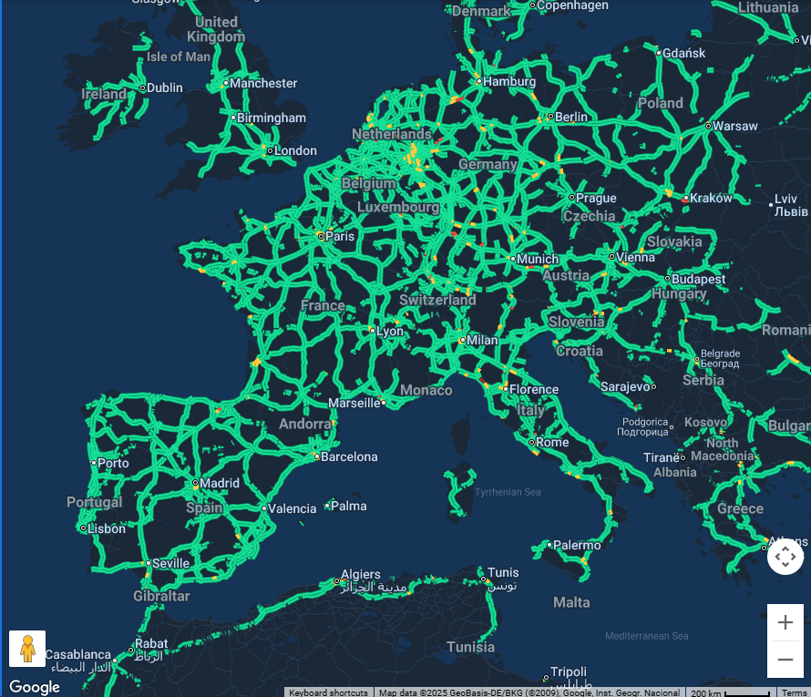

---

# Live Weather Layer by OpenWeather API (Optional)

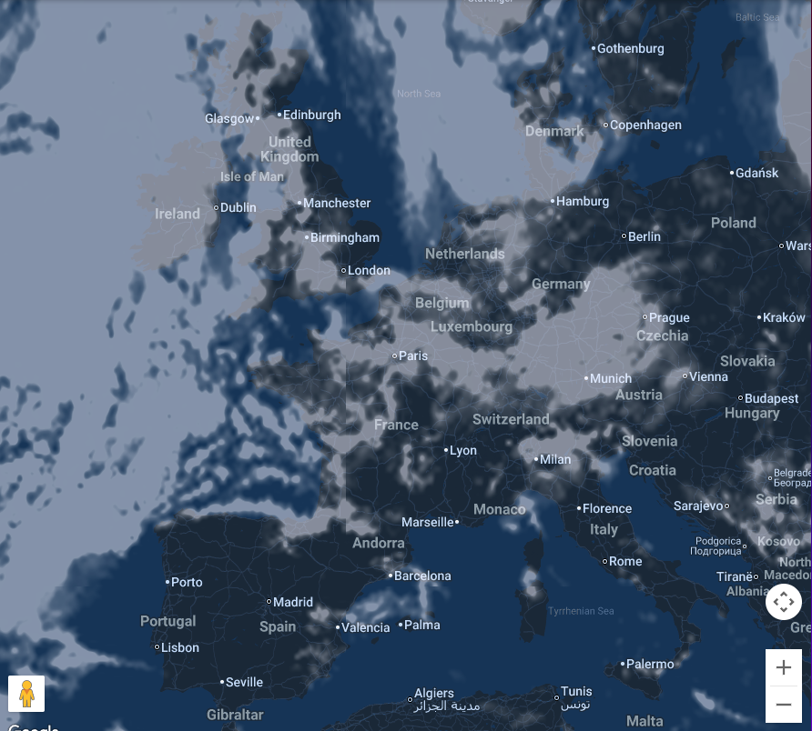

You need to create api key from openweathermap.org. Please create API v1.0. It is free. Please find the section below and create free API on [https://openweathermap.org/price](https://openweathermap.org/price). **DO NOT** create API of One Call API 3.0

API v1.0 is enough and it is free.

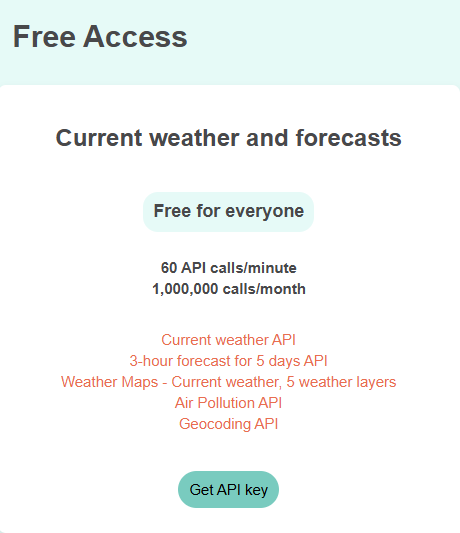

## Weather Layer Appearance

By default, the weather layer renders at 60% opacity. Some layers (especially temperature) can obscure the map underneath. You can fine-tune how the layer looks using four settings, all available in the visual editor under the Layers section:

```yaml
weather_layer: temp_new
weather_layer_opacity: 0.4       # more transparent so the map stays visible
weather_layer_brightness: 0.9    # slightly dimmed
weather_layer_contrast: 1.4      # sharper weather patterns
weather_layer_saturation: 0.6    # softer colors
```

All four default to sensible values and only need to be set when you want to override them.

---

# Google Maps & Apple Map Application Support

You can open any point or location of your entities on Google Map or Apple Map mobile or web browser app.

For entity location: Click on entity picture and select your app on the opened popup

For any point on the map (Windows): Right click and select your app on the opened popup

For any point on the map (Mobile Phone): Hold your finger on any point for 2 seconds and select your app on the opened popup

> 💡 You can hide these links entirely by setting `hide_map_links: true` in your card config.

<br>

---

# POI Filtering

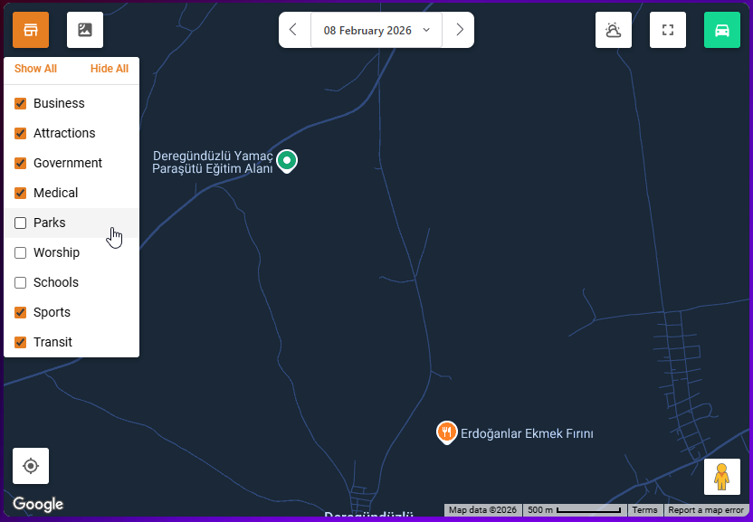

---

# Create Zone, Edit Zone, Delete Zone and Hide Zone

(Right click on browser or hold touch on mobile)

Create Zone:  Right click on map (outside a zone)

Edit Zone, Delete Zone and Hide Zone: Right click inside a zone

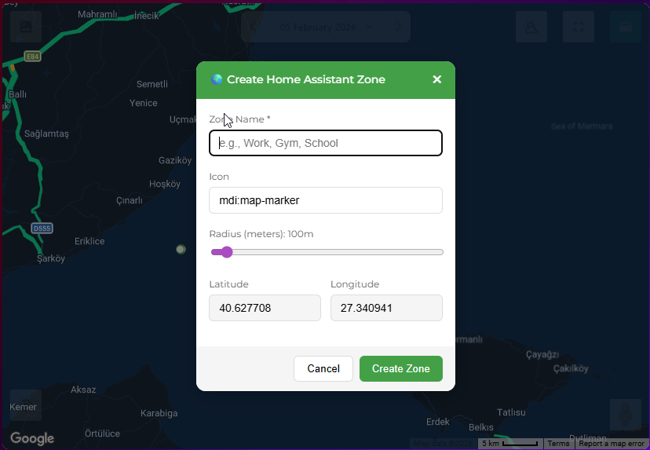
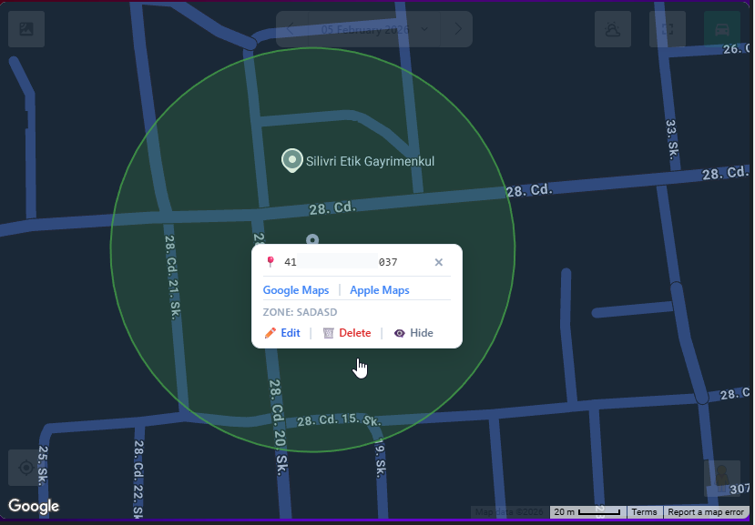
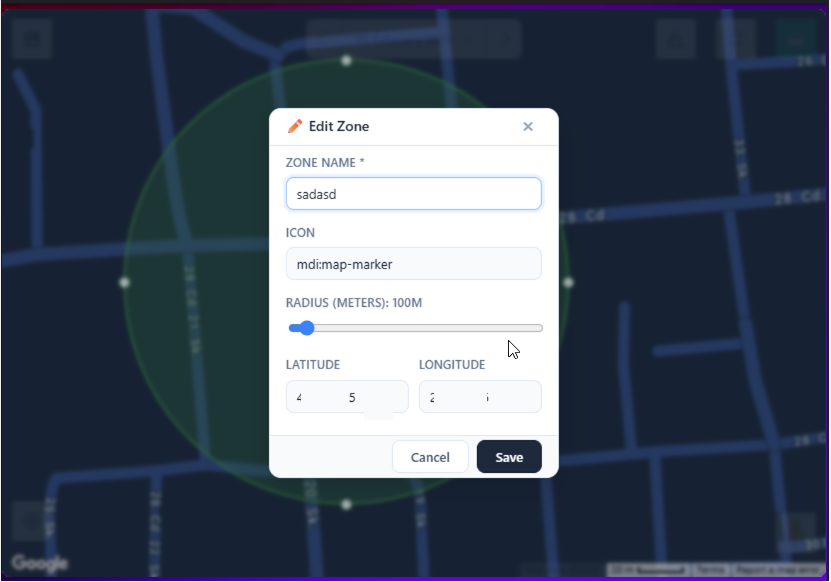
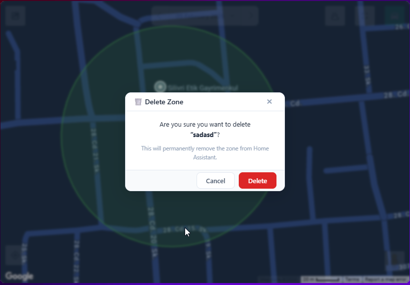

---

# Adding Geo Location Sources

If you have any integration providing geo location source, they will be automatically listed on the bottom of entity list.

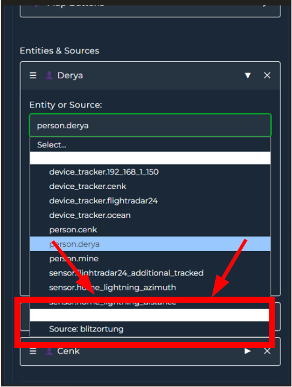

---


# ✈️ FlightRadar24 Support (v4.0.0)

This card supports **FlightRadar24** entities and includes a dedicated **FlightRadar panel** to browse and manage flights.

## What you get

* **FlightRadar panel** with a richer UI and responsive layouts

  * Horizontal panel (above/below)
  * Sidebar panel (left/right)
* **Airport Arrivals / Departures** support

  * Status **chips** (Estimated / Landed / Scheduled / Delayed / On Route, etc.)
  * Parses `status_text` such as `Delayed 16:25` into a **separate time column**
* **Quick actions** available from the map **RIGHT CLICK** popup (when FR24 is detected)

  * Add Flight
  * Remove Flight
  * Clear Flights

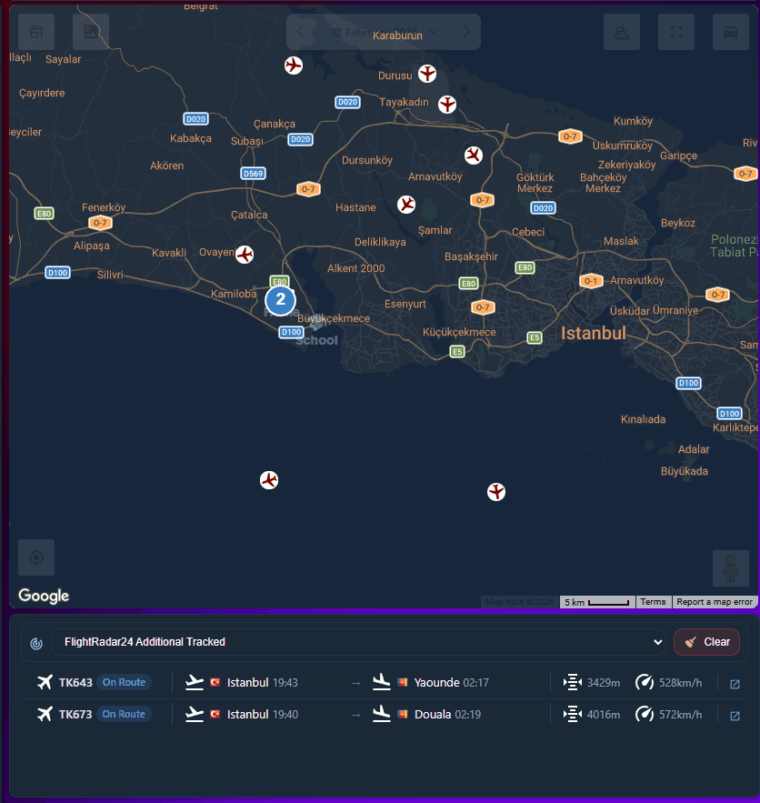

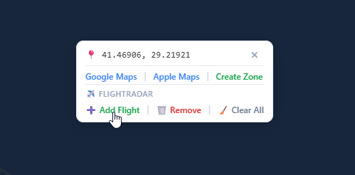

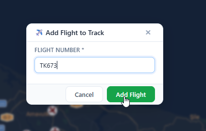

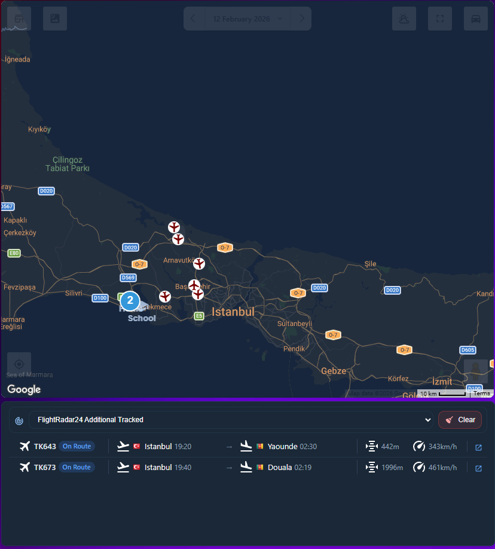

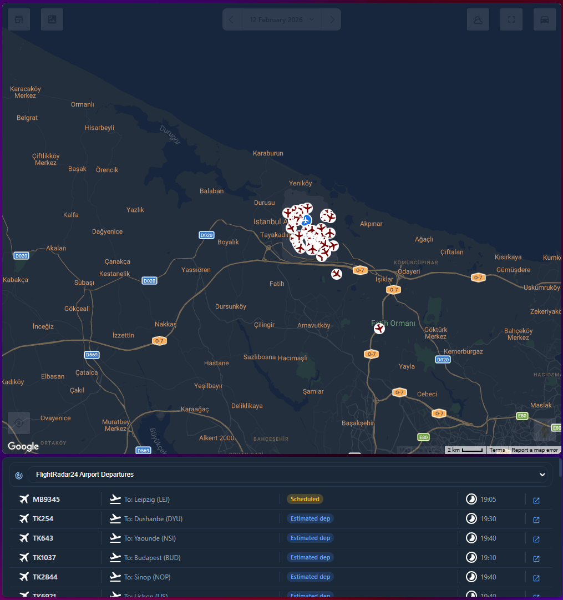

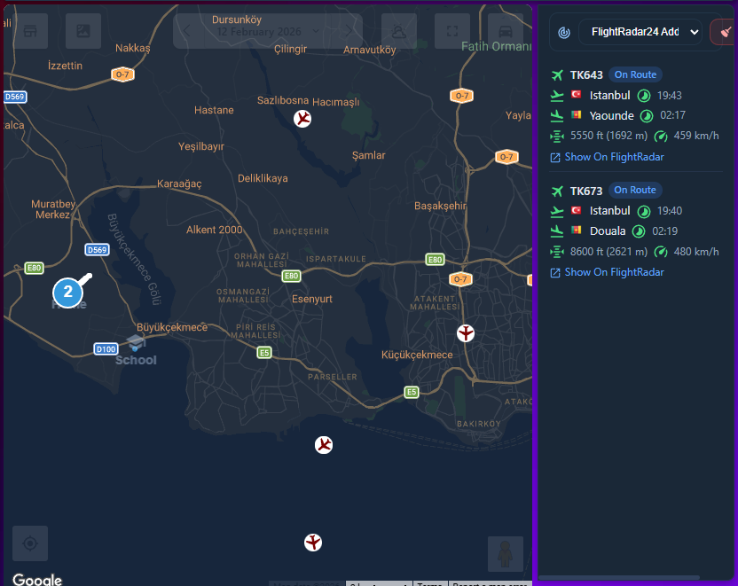

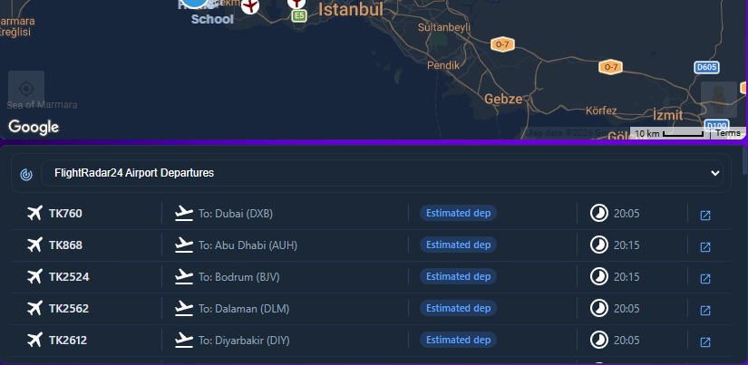

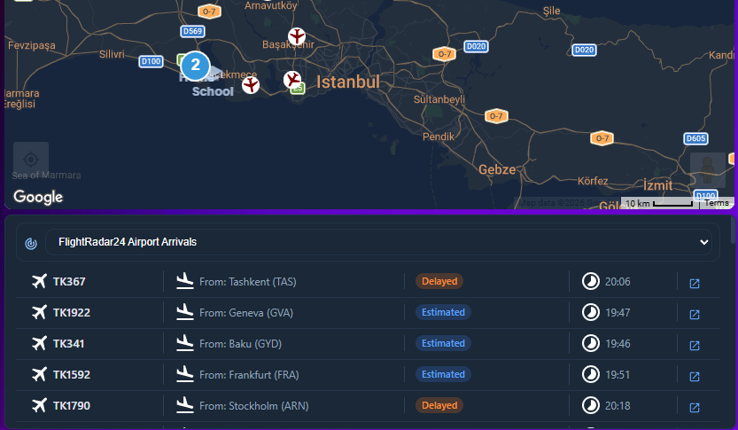

---


### Configuration

```yaml
travel_panel_enabled: true
travel_panel_position: below        # above | below
show_travel_panel_toggle_button: true
show_travel_panel_toggle_button_position: LEFT_BOTTOM
travel_shortcuts:
  - label: "Go to Work"
    icon: "mdi:office-building"
    from_entity: "person.cenk"
    to_entity: "zone.office"
  - label: "Go Home"
    icon: "mdi:home"
    from_entity: "person.cenk"
    to_entity: "zone.home"
```

---

# Enabling Clustering (History Dots)

If you enable clustering, route history markers will be grouped depending on zoom level.
More zoom = more granularity. This increases performance on slow systems.

> Note (v4.0.0): FlightRadar markers are excluded from clustering by design.

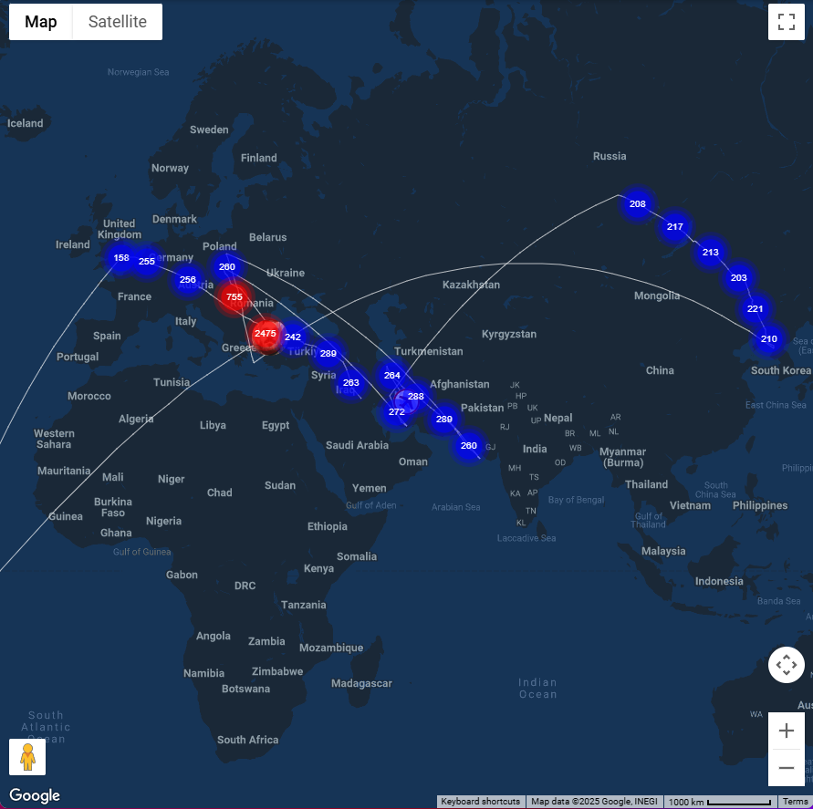

---

# Themes

You can choose your best theme—40 now and more to come!
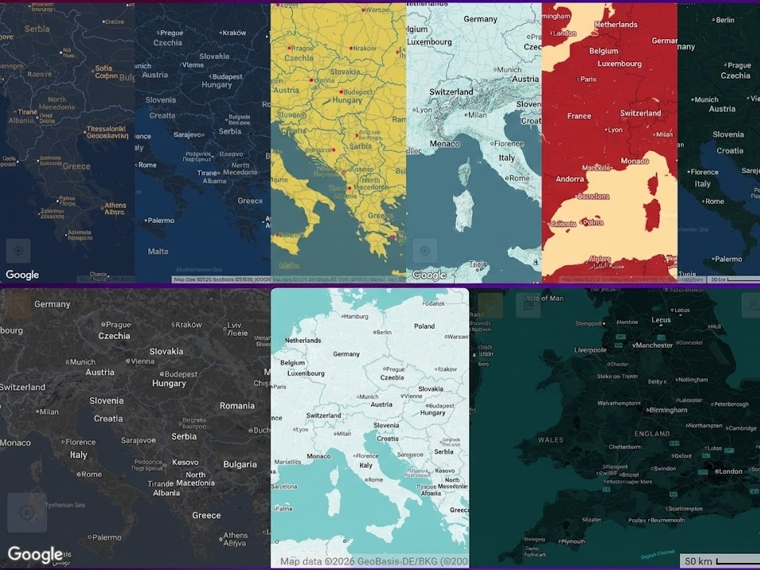

<br>

---

## 🔧 Parameters

### 🧹 General Options

| Key                    | Type    | Description                                                                                                                          |
| ---------------------- | ------- | ------------------------------------------------------------------------------------------------------------------------------------ |
| `type`                 | string  | Required for Home Assistant custom card. Must be `custom:google-map-card`.                                                           |
| `api_key`              | string  | Your Google Maps JavaScript API key (**required**).                                                                                  |
| `zoom`                 | integer / string | Initial zoom level (1–22). Accepts a static number (e.g. `12`) or a Home Assistant entity ID (e.g. `input_number.map_zoom`) for dynamic zoom control. |
| `theme_mode`           | string  | Map theme name from built-in themes (`Dark_Blueish_Night`, etc.). **Not available when `rendering_type: vector`** — use `color_scheme` instead. |
| `rendering_type`       | string  | Map rendering engine. `raster` (default) or `vector`. Vector mode enables free 360° rotation and tilt on all map types. See [Vector Map & Free Rotation](#-vector-map--free-rotation-new) below. |
| `color_scheme`         | string  | Color scheme for vector mode only. `light` (default), `dark`, or `follow_system`. Has no effect when `rendering_type: raster`. |
| `aspect_ratio`         | string  | Card aspect ratio (`16:9`, `4:3`, `1`, `1:1.56`, `400px`, etc.). If omitted, the card expands to fill its container — recommended for **Sections dashboard** users who set `grid_options: columns: full`. See [Dashboard Layout Tips](#-dashboard-layout-tips) below. |
| `map_type`             | string  | Map type: `roadmap`, `satellite`, `hybrid`, or `terrain`. Default: `roadmap`.                                                        |
| `gesture_handling`     | string  | `cooperative` for CTRL+SCROLL, `greedy` for just SCROLL, `auto`                                                                      |
| `marker_clustering`    | boolean | If `true`, **history dots** will be grouped depending on zoom level. Increases performance for slow systems.                         |
| `proximity_clustering` | boolean | If `true`, entities within the defined radius will be grouped until zoom level is higher than 17                                     |
| `proximity_radius`     | number  | Radius of proximity cluster default: 150                                                                                             |
| `spiderfy`             | boolean | If `true`, after some zoom level, icons of entities with exact location will be separated by some distance in order to see all icons |
| `allow_open_google_maps`   | boolean | Allow opening Google Maps from info popups via right-click / long-press. Default: `true`.             |
| `hide_map_links`           | boolean | Hide Google Maps & Apple Maps links from all info popups. Default: `false`. **NEW (v5.0.4)**          |
| `history_preset`           | string  | Relative date range preset. Accepted values: `today`, `yesterday`, `last7`, `last15`. When set, the date range is **recalculated on every page load** relative to the current date — so it never goes stale. Overrides `history_start_date` / `history_end_date`. |
| `history_start_date`   | string  | Fixed start of the date range (ISO 8601, e.g. `"2026-02-20T21:00:00.000Z"`). Used only when `history_preset` is `null`. |
| `history_end_date`     | string  | Fixed end of the date range (ISO 8601). Used only when `history_preset` is `null`. |

> ⚠️ Naming note: Older docs may mention `marker_clustring` / `clustring`. The correct key is **`marker_clustering`**.

> 📅 **Migration note (v4.0.2):** `history_start_date` and `history_end_date` have moved from **per-entity** to **card-level**. The per-entity boolean `use_date_range: true` now opts an entity into the shared card-level date range. Old configs with per-entity dates will be auto-migrated on first edit.

### 👤 Entities

| Key                             | Type    | Description                                                                                                                     |
| ------------------------------- | ------- | ------------------------------------------------------------------------------------------------------------------------------- |
| `entities`                      | list    | A list of `device_tracker`, `person`, or `zone` entities to show on the map (**required if no geo location sources provided**). |
| `entity`                        | string  | Entity ID to track.                                                                                                             |
| `icon_size`                     | integer | Size of the icon for this entity.                                                                                               |
| `icon_color`                    | string  | Icon color (e.g., `#ffffff`).                                                                                                   |
| `background_color`              | string  | Background color of the icon.                                                                                                   |
| `hours_to_show`                 | integer | Number of hours of location history to show. Use `0` to disable history. Ignored when `use_date_range: true`.                   |
| `polyline_color`                | string  | Color of the polyline for route history.                                                                                        |
| `polyline_width`                | integer | Width of the polyline for route history.                                                                                        |
| `follow`                        | boolean | If `true`, map will center on this entity. When multiple entities have `follow: true`, the map will fit all of them.            |
| `show_history_dots`             | boolean | If `false`, location history dots are not rendered. May increase speed of map rendering for long time period data.              |
| `history_dot_shape`             | string  | Shape of history dots: `circle` (default), `square`, `triangle`, `diamond`, `star`, `pentagon`. Helps distinguish entities with similar colors. |
| `history_dot_size`              | integer | Size of history dots in pixels. When omitted, auto-derived from polyline width (4× polyline width, minimum 4px). |
| `history_dot_filled`            | boolean | If `true` (default), dots are filled solid. If `false`, dots are rendered as outlines only. |
| `use_date_range`                | boolean | If `true`, this entity uses the **card-level** date range (`history_preset` or `history_start_date`/`history_end_date`) instead of `hours_to_show`. When enabled, `hours_to_show` is ignored for this entity. |
| `gps_accuracy_ranges`           | obj     | `min`,`max`,`label`,`color`,`opacity` see example below                                                                         |
| `show_gps_accuracy_radius_line` | boolean | **NEW (v4.0.0)** Draw a thin radius line + label showing GPS accuracy distance (zoom-aware)                                     |

### 👤 Geo Location Sources

| Key                    | Type | Description                                                                                |
| ---------------------- | ---- | ------------------------------------------------------------------------------------------ |
| `geo_location_sources` | list | Geo Location Sources listed in entity selection list (**required if no entity provided**). |

### 🕹️ Map Buttons

| Key                      | Type    | Description                                                                                     |
| ------------------------ | ------- | ----------------------------------------------------------------------------------------------- |
| `cameraControl`          | boolean | In **raster mode**: shows/hides the native pan control. In **vector mode**: shows/hides a custom **rotate & tilt grid** (↑↓ tilt, ←→ rotate, ⟳ reset) — the native pan buttons are replaced entirely. |
| `zoomControl`            | boolean | Show or hide zoom control.                                                                      |
| `streetViewControl`      | boolean | Show or hide Street View control.                                                               |
| `fullscreenControl`      | boolean | Show or hide fullscreen control.                                                                |
| `mapTypeControl`         | boolean | Show or hide map type selector.                                                                 |
| `rotateControl`          | boolean | Show or hide rotate/tilt control. **Limited support** — only functional in `satellite` or `hybrid` map types, at high zoom levels (15+), and only in cities where Google provides 45° aerial imagery (e.g. New York, London, Tokyo). Has no effect on standard road maps. See [Rotate & Tilt Limitations](#%EF%B8%8F-rotate--tilt-limitations) below. |
| `showScale`              | boolean | Show or hide the scale bar.                                                                     |
| `show_poi_button`        | boolean | Show or hide the poi selector.                                                                  |
| `keyboardShortcuts`      | boolean | Enable or disable keyboard shortcuts for navigation.                                            |
| `show_traffic_button`    | boolean | Show or hide Traffic Layer Toggle Button.                                                       |
| `show_weather_button`    | boolean | Show or hide Weather Layer dropdown menu.                                                       |
| `show_datepicker_button` | boolean | Show or hide Calendar. (`use_date_range` should be enabled for at least one entity)                   |
| `show_recenter_button`   | boolean | Show or hide Recenter Map Button.                                                               |
| `buttons_opacity`        | float   | Opacity of all buttons on the map. Buttons will be solid when hover                             |

### 🌍 Localization & External Control

| Key | Type | Description |
| --- | --- | --- |
| `language` | string | BCP-47 language tag for map labels and date/number formatting (e.g. `en`, `tr`, `ja`, `ru`, `he`, `de-DE`). Leave empty to follow the Home Assistant profile language. Requires page reload after change. |
| `history_date_entity` | string | `input_datetime` entity that controls the history date range. The selected day is automatically expanded to 00:00–23:59. |
| `history_start_entity` | string | `input_datetime` entity for the start of an explicit date range. Used together with `history_end_entity`. |
| `history_end_entity` | string | `input_datetime` entity for the end of an explicit date range. Used together with `history_start_entity`. If both range entities are set, they take precedence over `history_date_entity`. |

### 📚 Layers

| Key             | Type    | Description                                                                                                                  |
| --------------- | ------- | ---------------------------------------------------------------------------------------------------------------------------- |
| `show_traffic`  | boolean | Show or hide live traffic. No extra api key needed                                                                           |
| `weather_layer` | string  | Add weather layer. `none`, `precipitation_new`, `pressure_new`, `wind_new`, `temp_new`, `clouds_new`                         |
| `weather_layer_opacity` | number | Transparency of the weather layer (0.0 = invisible, 1.0 = fully opaque). Default: `0.6` |
| `weather_layer_brightness` | number | Brightness of the weather layer (1.0 = normal). Lower values darken, higher values brighten. Default: `1.0` |
| `weather_layer_contrast` | number | Contrast of weather patterns (1.0 = normal). Increase to make patterns more visible. Default: `1.0` |
| `weather_layer_saturation` | number | Color intensity of the weather layer (1.0 = normal, 0 = grayscale). Default: `1.0` |
| `owm_api_key`   | string  | Create api and restrict it 1000 per day [https://home.openweathermap.org/api_keys](https://home.openweathermap.org/api_keys) |

### 🔝 Button Positions

| Key                               | Type   | Description                                         |
| --------------------------------- | ------ | --------------------------------------------------- |
| `cameraControl_position`          | string | Position of the pan control (e.g., `RIGHT_BOTTOM`). |
| `zoomControl_position`            | string | Position of the zoom control.                       |
| `streetViewControl_position`      | string | Position of the Street View control.                |
| `fullscreenControl_position`      | string | Position of the fullscreen control.                 |
| `mapTypeControl_position`         | string | Position of the map type selector.                  |
| `rotateControl_position`          | string | Position of the rotate/tilt control.                |
| `show_traffic_button_position`    | string | Position of the traffic layer toggle button         |
| `show_poi_button_position`        | string | Position of the poi selector button                 |
| `show_weather_button_position`    | string | Position of the weather layer dropdown menu         |
| `show_recenter_button_position`   | string | Position of the recenter map button                 |
| `show_datepicker_button_position` | string | Position of the calendar                            |
| `show_travel_panel_toggle_button_position` | string | Position of the travel panel toggle button    |

### ⚠️ Rotate & Tilt Limitations (Raster Mode)

The `rotateControl` button in **raster mode** (default) allows rotating and tilting the map to a 45° perspective view, but it comes with significant Google API constraints that are important to understand.

**When it works:**
- Map type must be set to `satellite` or `hybrid`
- Zoom level must be **15 or higher**
- You must be in a city where Google has captured **45° aerial imagery**

**Cities with known 45° imagery support** (non-exhaustive):
New York, Los Angeles, San Francisco, Chicago, Miami, London, Paris, Berlin, Tokyo, Sydney, Toronto, Amsterdam, Barcelona, Rome, Dubai

**When it does NOT work:**
- `map_type: roadmap` or `map_type: terrain` — the button will appear but have no effect
- Rural areas, small towns, or regions without 45° Google imagery
- Low zoom levels (below ~15)

**Recommended config for best results with raster `rotateControl`:**

```yaml
map_type: satellite   # or hybrid
zoom: 17
rotateControl: true
rotateControl_position: LEFT_BOTTOM
```

> 💡 For full 360° free rotation on any map type, use `rendering_type: vector` instead. See below.

---

### 🔄 Vector Map & Free Rotation (NEW)

By setting `rendering_type: vector`, the card switches to Google Maps' WebGL-based vector renderer. This unlocks **free 360° rotation and tilt on any map type** — including roadmap and terrain — with no Map ID or Google Cloud Console setup required.

**What changes in vector mode:**

- `rotateControl: true` enables full drag-to-rotate and pinch-to-tilt gestures
- `cameraControl: true` shows a **custom rotate & tilt grid** instead of the native pan buttons:

```
        [ ↑ Decrease Tilt ]
[ ← Rotate ]  [ ⟳ Reset ]  [ → Rotate ]
        [ ↓ Increase Tilt ]
```

  Rotate step: **15°** — Tilt step: **10°** (range: 0°–67.5°) — ⟳ resets both to 0

- **Right-click + drag** tilts the map: drag down → more perspective, drag up → flatter. Release without dragging → right-click popup opens normally
- `theme_mode` is **not supported** — use `color_scheme` instead (`light`, `dark`, `follow_system`)
- The 40+ built-in JSON themes are unavailable (Google API limitation — the `styles` array only works on raster maps)
- Requires a WebGL-capable browser (all modern browsers supported by Home Assistant qualify)

**Config example:**

```yaml
type: custom:google-map-card
api_key: YOUR_API_KEY
rendering_type: vector
color_scheme: dark          # light | dark | follow_system
cameraControl: true         # shows rotate/tilt grid in vector mode
cameraControl_position: RIGHT_BOTTOM
rotateControl: true         # enables drag-to-rotate & pinch-to-tilt gestures
map_type: roadmap
zoom: 15
```

**Raster vs Vector — quick comparison:**

| | Raster (default) | Vector |
|---|---|---|
| Free 360° rotation | ❌ | ✅ |
| Rotate/tilt grid control | ❌ | ✅ (via `cameraControl`) |
| Right-click drag to tilt | ❌ | ✅ |
| 40+ built-in themes | ✅ | ❌ |
| Dark / Light mode | Via themes | `color_scheme` |
| POI filtering | ✅ | ✅ |
| Traffic layer | ✅ | ✅ |
| Weather layer | ✅ | ✅ |
| GPU / WebGL required | ❌ | ✅ |

> ⚠️ `color_scheme` can only be set at map initialization. If you change it, the page must reload to take effect. In Home Assistant, saving the card config triggers a reload automatically.

### 🎯 Zones

| Key                  | Type    | Description                                               |
| -------------------- | ------- | --------------------------------------------------------- |
| `zones`              | object  | Defines `zone` entities to show on the map, with styling. |
| `show`               | boolean | Whether to display the zone or not.                       |
| `color`              | string  | Fill color for the zone area (e.g., `#3498db`).           |
| `zone_opacity`       | float   | Opacity for the zone fill color (0.0 to 1.0).             |
| `zone_label_opacity` | float   | Opacity for the zone label color (0.0 to 1.0).            |
| `follow`             | boolean | Centre the map                                            |

### 🏪 POI

| Key               | Type   | Description                                                                                                          |
| ----------------- | ------ | -------------------------------------------------------------------------------------------------------------------- |
| `hide_poi_types:` | object | `business`, `attraction`, `government`, `medical`, `park`, `place_of_worship`, `school`, `sports_complex`, `transit` |

### 🚗 Route Search and Travel Time Calculator

| Key                                    | Type    | Description                                                                                           |
| -------------------------------------- | ------- | ----------------------------------------------------------------------------------------------------- |
| `travel_panel_enabled`                     | boolean | Enable or disable the Route Search and Travel Time Calculator panel. Default: `true`.                 |
| `travel_panel_position`                    | string  | Panel position relative to the map: `above` or `below`. Default: `above`.                            |
| `show_travel_panel_toggle_button`          | boolean | Show or hide the toggle button on the map. Default: `true`.                                           |
| `show_travel_panel_toggle_button_position` | string  | Position of the toggle button on the map. Default: `LEFT_BOTTOM`.                                    |
| `travel_shortcuts`                     | list    | List of predefined route shortcuts for quick calculation.                                             |
| `travel_shortcuts[].label`             | string  | Display label for the shortcut (e.g., `"Go to Work"`).                                                |
| `travel_shortcuts[].icon`              | string  | MDI icon for the shortcut button (e.g., `"mdi:office-building"`).                                     |
| `travel_shortcuts[].from_entity`       | string  | Source entity ID (`person.*`, `device_tracker.*`, or `zone.*`).                                       |
| `travel_shortcuts[].to_entity`         | string  | Destination entity ID (`person.*`, `device_tracker.*`, or `zone.*`).                                  |

**The following control positions are supported:**

`TOP_LEFT`, `TOP_CENTER`, `TOP_RIGHT`,
`LEFT_TOP`, `LEFT_CENTER`, `LEFT_BOTTOM`,
`RIGHT_TOP`, `RIGHT_CENTER`, `RIGHT_BOTTOM`,
`BOTTOM_LEFT`, `BOTTOM_CENTER`, `BOTTOM_RIGHT`

| Position        | Description                                                                                             |
| --------------- | ------------------------------------------------------------------------------------------------------- |
| `TOP_CENTER`    | Control placed along the top center of the map.                                                         |
| `TOP_LEFT`      | Control placed along the top left of the map, with sub-elements “flowing” toward the top center.        |
| `TOP_RIGHT`     | Control placed along the top right of the map, with sub-elements “flowing” toward the top center.       |
| `LEFT_TOP`      | Control placed along the top left of the map, but below any `TOP_LEFT` elements.                        |
| `RIGHT_TOP`     | Control placed along the top right of the map, but below any `TOP_RIGHT` elements.                      |
| `LEFT_CENTER`   | Control placed along the left side of the map, centered between `TOP_LEFT` and `BOTTOM_LEFT`.           |
| `RIGHT_CENTER`  | Control placed along the right side of the map, centered between `TOP_RIGHT` and `BOTTOM_RIGHT`.        |
| `LEFT_BOTTOM`   | Control placed along the bottom left of the map, but above any `BOTTOM_LEFT` elements.                  |
| `RIGHT_BOTTOM`  | Control placed along the bottom right of the map, but above any `BOTTOM_RIGHT` elements.                |
| `BOTTOM_CENTER` | Control placed along the bottom center of the map.                                                      |
| `BOTTOM_LEFT`   | Control placed along the bottom left of the map, with sub-elements “flowing” toward the bottom center.  |
| `BOTTOM_RIGHT`  | Control placed along the bottom right of the map, with sub-elements “flowing” toward the bottom center. |

<br>

---

# Card Example

```yaml
type: custom:google-map-card
api_key: <<GOOGLE API KEY>>
owm_api_key: <<OPEN WEATHER API KEY>>
theme_mode: Dark_Blueish_Night
map_type: roadmap
zoom: 16
aspect_ratio: 1.53:1
weather_layer: clouds_new
weather_layer_opacity: 0.5

proximity_clustering: true
proximity_radius: 5

marker_clustering: false
spiderfy: true
gesture_handling: greedy

camera_control: false
zoom_control: false
zoom_control_position: RIGHT_BOTTOM
street_view_control: false
street_view_control_position: LEFT_BOTTOM
fullscreen_control: false
fullscreen_control_position: RIGHT_TOP
map_type_control: false
map_type_control_position: TOP_LEFT
map_type_control_style: DROPDOWN_MENU
rotate_control: false
pan_control: true
show_scale: false
scaleControlPosition: BOTTOM_LEFT
keyboard_shortcuts: false
show_traffic_button: true
show_traffic_button_position: TOP_RIGHT
show_weather_button: true
show_weather_button_position: TOP_RIGHT
show_recenter_button: true
show_recenter_button_position: LEFT_BOTTOM
show_datepicker_button: true
show_datepicker_button_position: TOP_CENTER
show_traffic: false
show_history_dots: true

travel_panel_enabled: true
travel_panel_position: below
show_travel_panel_toggle_button: true
show_travel_panel_toggle_button_position: LEFT_BOTTOM
travel_shortcuts:
  - label: "Go to Work"
    icon: "mdi:office-building"
    from_entity: "person.cenk"
    to_entity: "zone.work"
  - label: "Go Home"
    icon: "mdi:home"
    from_entity: "person.cenk"
    to_entity: "zone.home"

zones:
  zone.work:
    show: false
    color: "#3498db"
    follow: false
    label_color: "#c4dbf9"
  zone.work_2:
    show: false
    color: "#3498db"
    follow: false
    label_color: "#c4dbf9"
  zone.home:
    show: true
    color: "#3498db"
    follow: false
    label_color: "#c4dbf9"

# Date range (card-level) — applies to all entities with use_date_range: true
# Option A: Use a preset (recalculated on every page load)
history_preset: today  # today | yesterday | last7 | last15
# Option B: Use a fixed date range
# history_preset: null
# history_start_date: "2026-02-20T21:00:00.000Z"
# history_end_date: "2026-02-21T20:55:00.000Z"

entities:
  - entity: device_tracker.flightradar24
    icon_size: 30
    hours_to_show: 10
    polyline_color: "#ffffff"
    polyline_width: 1
    icon_color: "#780202"
    background_color: "#ffffff"

  - entity: person.cenk
    icon_size: 30
    hours_to_show: 0
    use_date_range: true
    polyline_color: "#ffffff"
    polyline_width: 1
    icon_color: "#780202"
    background_color: "#ffffff"
    history_dot_shape: diamond
    show_gps_accuracy_radius_line: true
    gps_accuracy_ranges:
      - min: 0
        max: 15
        label: Excellent (0-15m)
        color: "#15cb1b"
        opacity: 0.6
      - min: 16
        max: 100
        label: Good (16-100m)
        color: "#0dccf2"
        opacity: 1
      - min: 101
        max: 250
        label: Fair (101-250m)
        color: "#ffeb3b"
        opacity: 1
      - min: 251
        max: 500
        label: Poor (251-500m)
        color: "#ff9800"
        opacity: 1
      - min: 501
        max: 99999
        label: Very Poor (501m+)
        color: "#f44336"
        opacity: 1

  - entity: person.derya
    icon_size: 30
    hours_to_show: 0
    use_date_range: true
    polyline_color: "#ffffff"
    polyline_width: 1
    icon_color: "#780202"
    background_color: "#ffffff"
    history_dot_shape: triangle
    history_dot_filled: false
```

## ⭐ Support

If you like this card, feel free to ⭐ star the project on GitHub and share it with the Home Assistant community or buy me a coffee!

<a href="https://www.buymeacoffee.com/cataseven" target="_blank">
  
</a>

## Star History

[](https://www.star-history.com/#cataseven/Google-Map-Card&type=date&legend=top-left)
