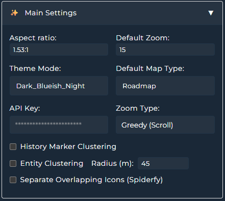

<a href="https://www.buymeacoffee.com/cataseven" target="_blank">
  
</a>

# Google Maps Card for Home Assistant


[](https://github.com/hacs/frontend)
[](https://github.com/cataseven/Google-Map-Card/releases)
[](LICENSE)


[](https://github.com/cataseven/Google-Map-Card)
[](https://github.com/cataseven/Google-Map-Card/issues)


#### Responsive Lovelace custom Google Maps card that displays the location of `person.`, `device_tracker.`, and `sensor.` entities and tracks their routes using the Google Maps JavaScript API including Live Traffic, Street View, POI Filtering, Map Types, FlightRadar24 Integration and **Route Search and Travel Time Calculator** support

---

# Features

* **Route Search and Travel Time Calculator** 🆕
  * **NEW (v5.0.0): Docked travel panel with real-time route calculation, live traffic-colored polylines, address autocomplete, route shortcuts, and multi-modal support (driving/walking/transit/cycling)**
* Live Traffic Info
* Weather Layers (via OpenWeather API Key)
* **FlightRadar24 integration support**
  * **NEW (v4.0.0): Dedicated FlightRadar panel + airport arrivals/departures table + Add/Remove Flight directly on the map via right click button**
* Create Zone, Edit Zone, Delete Zone directly from the card (right click / long press)
* Show Zones
* POI Filtering
* Street View
* Route tracking (polylines + history dots)
* Themes (40+ built‑in)
* Interactive Google Map view
* Dynamic selection of person/zone/device_tracker entities
* Geo Location sources auto-listing (from HA geo integrations)
* Map terrain types (Map, Satellite, Hybrid, Terrain)
* Custom zoom level
* Fully responsive iframe layout with `aspect_ratio`
* **Show/hide map controls** (Pan, Zoom, Street View, Fullscreen, Map Type, Rotate)
* **Control positions of buttons**
* **Scale bar** and **keyboard shortcuts** support
* **Follow** mode: auto‑center map on selected entity/entities
* **Marker clustering** (history dots) for performance on slower systems
* **Proximity clustering** (entities grouped within a radius until zoom >= 17)
* **Spiderfy / overlap separation** (high zoom) for entities with the exact same location
* **GPS Accuracy visualization**
  * Accuracy styling via `gps_accuracy_ranges`
  * **NEW (v4.0.0): optional GPS accuracy radius line + label** per entity

     <br>

---

# Attention

💡 Google Maps JavaScript API must be enabled in your Google Cloud project:
[https://console.cloud.google.com/google/maps-apis/api-list](https://console.cloud.google.com/google/maps-apis/api-list)

If you plan to use the **Route Search and Travel Time Calculator**, you also need to enable these additional APIs:

| API | Purpose | Required for |
|-----|---------|-------------|
| **Maps JavaScript API** | Core map rendering | All features (required) |
| **Directions API** | Route calculation, alternatives, duration & distance | Route Search and Travel Time Calculator |
| **Places API (New)** | Address autocomplete in travel panel | Route Search and Travel Time Calculator |
| **Routes API** | Real-time traffic segment data for color-coded polylines | Route Search and Travel Time Calculator |


---

# Attention

💡 Most Google APIs have quotas and exceeding limits may incur charges. However Google Maps JavaScript API itself has no daily limit and it is free and unlimited as of August, 2025 until any policy change. However You are solely responsible for your API settings, API Quotas, API Quota Alarms or any charges incurred on your Google Cloud account.


However it is good to watch your monthly quota to stay on the safe side. Here is the link for quota stats:
[https://console.cloud.google.com/google/maps-apis/quotas](https://console.cloud.google.com/google/maps-apis/quotas)?

If you want to stay on the safe side just set limit and quota alarm for your api. Google can change its policy anytime so also follow policy changes. Also watch this review by @BeardedTinker before creating API. Search web to understand how to limit your API to stay within free-to-use limits
[https://youtu.be/usGLOxtXCxA?si=BxDj65bksi_tcZek](https://youtu.be/usGLOxtXCxA?si=BxDj65bksi_tcZek)

### ⚠️ Route Search and Travel Time Calculator — Quota Notice

The Route Search and Travel Time Calculator uses **multiple pay as go APIs** per route calculation. Most of them have high free limits also many of them are unlimitied. But staying on the safe side is always a good thing to do. This lovelace card enforces a **built-in daily limit of 30 route calculations per API key** (shared across all card instances using the same key on the same browser). However, each calculation triggers multiple API calls:

| Action | Approximate API Calls |
|--------|----------------------|
| 1× Route calculation | 1× Directions API |
| Traffic overlay | 1× Routes API |
| Address autocomplete | ~3–5× Places API (per typing session) |

**So 30 calculations could mean 150+ total API calls per day.** Google provides a 5000 / 10000 (also most of them are unlimited) api calls per month for free which covers significant usage, but you should still configure quotas in Cloud Console:

1. Go to **APIs & Services → Quotas** and set daily request limits per API
2. Go to **Billing → Budgets & Alerts** and create a budget alert (e.g., $5/month)
3. Consider restricting your API key to only the APIs you use

> ⚠️ **The card's 30/day limit is a soft safety net — it is NOT a substitute for proper Cloud Console quota configuration.**

Create API key and click the “Show key” button in the console:


---

<br>

# Installation

## Via HACS

1. Go to **HACS**
2. Search for **Google Map Card**
3. Download & install

---

# Adding the Card to Dashboard

Add via the Lovelace card picker (search “Google Map Card”)
or define it in YAML (see Card Example below):

<br>


<br>

# UI Card Editor

  

 

 

 


---

# 🚗 Route Search and Travel Time Calculator (v5.0.0)


Calculate real-time travel times between any combination of **entities**, **zones**, or **typed addresses** — directly from your dashboard. The panel supports driving, walking, transit, and cycling modes with **live traffic visualization** on the map.

## What you get

* **Docked travel panel** with flexible positioning (above / below / left / right of the map)
* **Multi-modal routing** — Driving 🚗, Walking 🚶, Transit 🚌, Cycling 🚴
* **Live traffic-colored routes** for driving mode:
  * 🟢 Green — Normal flow
  * 🟡 Yellow — Slow traffic
  * 🔴 Red — Heavy traffic / Traffic jam
* **Alternative routes** — switch between options and see traffic coloring for each
* **Address autocomplete** — powered by Places API (New) with instant suggestions
* **Route Shortcuts** ⚡ — define frequently used routes with custom icons and labels for one-tap calculation
  * Supports `person`, `device_tracker`, and `zone` entities
  * Collapsible editor with label-based headers
* **Toggle button** on the map to show/hide the panel — position configurable in Map Button Positioning

### Required APIs

The Route Search and Travel Time Calculator requires these additional APIs to be enabled in [Google Cloud Console](https://console.cloud.google.com/apis/library):

* **Directions API** — Route calculation
* **Places API (New)** — Address autocomplete
* **Routes API** — Traffic segment data
* **Geocoding API** — Entity/zone position resolution


# Live Traffic Info by Google Maps

Optional. Real time traffic layer


---

# Live Weather Layer by OpenWeather API (Optional)


You need to create api key from openweathermap.org. Please create API v1.0. It is free. Please find the section below and create free API on [https://openweathermap.org/price](https://openweathermap.org/price). **DO NOT** create API of One Call API 3.0

API v1.0 is enough and it is free.


---

# Google Maps & Apple Map Application Support

You can open any point or location of your entities on Google Map or Apple Map mobile or web browser app.

For entity location: Click on entity picture and select your app on the opened popup

For any point on the map (Windows): Right click and select your app on the opened popup

For any point on the map (Mobile Phone): Hold your finger on any point for 2 seconds and select your app on the opened popup

<br>

---

# POI Filtering


---

# Create Zone, Edit Zone, Delete Zone and Hide Zone

(Right click on browser or hold touch on mobile)

Create Zone:  Right click on map (outside a zone)

Edit Zone, Delete Zone and Hide Zone: Right click inside a zone


---

# Adding Geo Location Sources

If you have any integration providing geo location source, they will be automatically listed on the bottom of entity list.


---


# ✈️ FlightRadar24 Support (v4.0.0)

This card supports **FlightRadar24** entities and includes a dedicated **FlightRadar panel** to browse and manage flights.

## What you get

* **FlightRadar panel** with a richer UI and responsive layouts

  * Horizontal panel (above/below)
  * Sidebar panel (left/right)
* **Airport Arrivals / Departures** support

  * Status **chips** (Estimated / Landed / Scheduled / Delayed / On Route, etc.)
  * Parses `status_text` such as `Delayed 16:25` into a **separate time column**
* **Quick actions** available from the map **RIGHT CLICK** popup (when FR24 is detected)

  * Add Flight
  * Remove Flight
  * Clear Flights


---


### Configuration

```yaml
travel_panel_enabled: true
travel_panel_position: below        # above | below | left | right
travel_panel_size: 310              # Height (px) for above/below, Width for left/right
travel_panel_toggle_button_position: LEFT_BOTTOM
travel_shortcuts:
  - label: "Go to Work"
    icon: "mdi:office-building"
    from_entity: "person.cenk"
    to_entity: "zone.office"
  - label: "Go Home"
    icon: "mdi:home"
    from_entity: "person.cenk"
    to_entity: "zone.home"
```

---

# Enabling Clustering (History Dots)

If you enable clustering, route history markers will be grouped depending on zoom level.
More zoom = more granularity. This increases performance on slow systems.

> Note (v4.0.0): FlightRadar markers are excluded from clustering by design.


---

# Themes

You can choose your best theme—40 now and more to come!


<br>

---

## 🔧 Parameters

### 🧹 General Options

| Key                    | Type    | Description                                                                                                                          |
| ---------------------- | ------- | ------------------------------------------------------------------------------------------------------------------------------------ |
| `type`                 | string  | Required for Home Assistant custom card. Must be `custom:google-map-card`.                                                           |
| `api_key`              | string  | Your Google Maps JavaScript API key (**required**).                                                                                  |
| `zoom`                 | integer | Initial zoom level (1–20).                                                                                                           |
| `theme_mode`           | string  | Map theme name from built-in themes (`Dark_Blueish_Night`, etc.).                                                                    |
| `aspect_ratio`         | string  | Card aspect ratio (`16:9`, `4:3`, `1`, `1:1.56`, `400px`, etc.).                                                                     |
| `map_type`             | string  | Map type: `roadmap`, `satellite`, `hybrid`, or `terrain`. Default: `roadmap`.                                                        |
| `gesture_handling`     | string  | `cooperative` for CTRL+SCROLL, `greedy` for just SCROLL, `auto`                                                                      |
| `marker_clustering`    | boolean | If `true`, **history dots** will be grouped depending on zoom level. Increases performance for slow systems.                         |
| `proximity_clustering` | boolean | If `true`, entities within the defined radius will be grouped until zoom level is higher than 17                                     |
| `proximity_radius`     | number  | Radius of proximity cluster default: 150                                                                                             |
| `spiderfy`             | boolean | If `true`, after some zoom level, icons of entities with exact location will be separated by some distance in order to see all icons |
| `history_preset`       | string  | Relative date range preset. Accepted values: `today`, `yesterday`, `last7`, `last15`. When set, the date range is **recalculated on every page load** relative to the current date — so it never goes stale. Overrides `history_start_date` / `history_end_date`. |
| `history_start_date`   | string  | Fixed start of the date range (ISO 8601, e.g. `"2026-02-20T21:00:00.000Z"`). Used only when `history_preset` is `null`. |
| `history_end_date`     | string  | Fixed end of the date range (ISO 8601). Used only when `history_preset` is `null`. |

> ⚠️ Naming note: Older docs may mention `marker_clustring` / `clustring`. The correct key is **`marker_clustering`**.

> 📅 **Migration note (v4.0.2):** `history_start_date` and `history_end_date` have moved from **per-entity** to **card-level**. The per-entity boolean `use_date_range: true` now opts an entity into the shared card-level date range. Old configs with per-entity dates will be auto-migrated on first edit.

### 👤 Entities

| Key                             | Type    | Description                                                                                                                     |
| ------------------------------- | ------- | ------------------------------------------------------------------------------------------------------------------------------- |
| `entities`                      | list    | A list of `device_tracker`, `person`, or `zone` entities to show on the map (**required if no geo location sources provided**). |
| `entity`                        | string  | Entity ID to track.                                                                                                             |
| `icon_size`                     | integer | Size of the icon for this entity.                                                                                               |
| `icon_color`                    | string  | Icon color (e.g., `#ffffff`).                                                                                                   |
| `background_color`              | string  | Background color of the icon.                                                                                                   |
| `hours_to_show`                 | integer | Number of hours of location history to show. Use `0` to disable history. Ignored when `use_date_range: true`.                   |
| `polyline_color`                | string  | Color of the polyline for route history.                                                                                        |
| `polyline_width`                | integer | Width of the polyline for route history.                                                                                        |
| `follow`                        | boolean | If `true`, map will center on this entity. When multiple entities have `follow: true`, the map will fit all of them.            |
| `show_history_dots`             | boolean | If `false`, location history dots are not rendered. May increase speed of map rendering for long time period data.              |
| `use_date_range`                | boolean | If `true`, this entity uses the **card-level** date range (`history_preset` or `history_start_date`/`history_end_date`) instead of `hours_to_show`. When enabled, `hours_to_show` is ignored for this entity. |
| `gps_accuracy_ranges`           | obj     | `min`,`max`,`label`,`color`,`opacity` see example below                                                                         |
| `show_gps_accuracy_radius_line` | boolean | **NEW (v4.0.0)** Draw a thin radius line + label showing GPS accuracy distance (zoom-aware)                                     |

### 👤 Geo Location Sources

| Key                    | Type | Description                                                                                |
| ---------------------- | ---- | ------------------------------------------------------------------------------------------ |
| `geo_location_sources` | list | Geo Location Sources listed in entity selection list (**required if no entity provided**). |

### 🕹️ Map Buttons

| Key                      | Type    | Description                                                                                     |
| ------------------------ | ------- | ----------------------------------------------------------------------------------------------- |
| `cameraControl`          | boolean | Show or hide pan control.                                                                       |
| `zoomControl`            | boolean | Show or hide zoom control.                                                                      |
| `streetViewControl`      | boolean | Show or hide Street View control.                                                               |
| `fullscreenControl`      | boolean | Show or hide fullscreen control.                                                                |
| `mapTypeControl`         | boolean | Show or hide map type selector.                                                                 |
| `rotateControl`          | boolean | Show or hide rotate/tilt control. Only works in some cities or zoom levels (Google limitation). |
| `showScale`              | boolean | Show or hide the scale bar.                                                                     |
| `show_poi_button`        | boolean | Show or hide the poi selector.                                                                  |
| `keyboardShortcuts`      | boolean | Enable or disable keyboard shortcuts for navigation.                                            |
| `show_traffic_button`    | boolean | Show or hide Traffic Layer Toggle Button.                                                       |
| `show_weather_button`    | boolean | Show or hide Weather Layer dropdown menu.                                                       |
| `show_datepicker_button` | boolean | Show or hide Calendar. (`use_date_range` should be enabled for at least one entity)                   |
| `show_recenter_button`   | boolean | Show or hide Recenter Map Button.                                                               |
| `buttons_opacity`        | float   | Opacity of all buttons on the map. Buttons will be solid when hover                             |

### 📚 Layers

| Key             | Type    | Description                                                                                                                  |
| --------------- | ------- | ---------------------------------------------------------------------------------------------------------------------------- |
| `show_traffic`  | boolean | Show or hide live traffic. No extra api key needed                                                                           |
| `weather_layer` | string  | Add weather layer. `none`, `precipitation_new`, `pressure_new`, `wind_new`, `temp_new`, `clouds_new`                         |
| `owm_api_key`   | string  | Create api and restrict it 1000 per day [https://home.openweathermap.org/api_keys](https://home.openweathermap.org/api_keys) |

### 🔝 Button Positions

| Key                               | Type   | Description                                         |
| --------------------------------- | ------ | --------------------------------------------------- |
| `cameraControl_position`          | string | Position of the pan control (e.g., `RIGHT_BOTTOM`). |
| `zoomControl_position`            | string | Position of the zoom control.                       |
| `streetViewControl_position`      | string | Position of the Street View control.                |
| `fullscreenControl_position`      | string | Position of the fullscreen control.                 |
| `mapTypeControl_position`         | string | Position of the map type selector.                  |
| `rotateControl_position`          | string | Position of the rotate/tilt control.                |
| `show_traffic_button_position`    | string | Position of the traffic layer toggle button         |
| `show_poi_button_position`        | string | Position of the poi selector button                 |
| `show_weather_button_position`    | string | Position of the weather layer dropdown menu         |
| `show_recenter_button_position`   | string | Position of the recenter map button                 |
| `show_datepicker_button_position` | string | Position of the calendar                            |
| `travel_panel_toggle_button_position` | string | Position of the travel panel toggle button    |

### 🎯 Zones

| Key                  | Type    | Description                                               |
| -------------------- | ------- | --------------------------------------------------------- |
| `zones`              | object  | Defines `zone` entities to show on the map, with styling. |
| `show`               | boolean | Whether to display the zone or not.                       |
| `color`              | string  | Fill color for the zone area (e.g., `#3498db`).           |
| `zone_opacity`       | float   | Opacity for the zone fill color (0.0 to 1.0).             |
| `zone_label_opacity` | float   | Opacity for the zone label color (0.0 to 1.0).            |
| `follow`             | boolean | Centre the map                                            |

### 🏪 POI

| Key               | Type   | Description                                                                                                          |
| ----------------- | ------ | -------------------------------------------------------------------------------------------------------------------- |
| `hide_poi_types:` | object | `business`, `attraction`, `government`, `medical`, `park`, `place_of_worship`, `school`, `sports_complex`, `transit` |

### 🚗 Route Search and Travel Time Calculator

| Key                                    | Type    | Description                                                                                           |
| -------------------------------------- | ------- | ----------------------------------------------------------------------------------------------------- |
| `travel_panel_enabled`                 | boolean | Enable or disable the Route Search and Travel Time Calculator panel.                                                   |
| `travel_panel_position`                | string  | Panel position relative to the map: `above`, `below`, `left`, `right`. Default: `below`.              |
| `travel_panel_size`                    | integer | Panel size in pixels. Height for above/below, Width for left/right. Default: `310`.                   |
| `travel_panel_toggle_button_position`  | string  | Position of the toggle button on the map. Default: `LEFT_BOTTOM`.                                     |
| `travel_shortcuts`                     | list    | List of predefined route shortcuts for quick calculation.                                             |
| `travel_shortcuts[].label`             | string  | Display label for the shortcut (e.g., `"Go to Work"`).                                                |
| `travel_shortcuts[].icon`              | string  | MDI icon for the shortcut button (e.g., `"mdi:office-building"`).                                     |
| `travel_shortcuts[].from_entity`       | string  | Source entity ID (`person.*`, `device_tracker.*`, or `zone.*`).                                       |
| `travel_shortcuts[].to_entity`         | string  | Destination entity ID (`person.*`, `device_tracker.*`, or `zone.*`).                                  |

**The following control positions are supported:**

`TOP_LEFT`, `TOP_CENTER`, `TOP_RIGHT`,
`LEFT_TOP`, `LEFT_CENTER`, `LEFT_BOTTOM`,
`RIGHT_TOP`, `RIGHT_CENTER`, `RIGHT_BOTTOM`,
`BOTTOM_LEFT`, `BOTTOM_CENTER`, `BOTTOM_RIGHT`

| Position        | Description                                                                                             |
| --------------- | ------------------------------------------------------------------------------------------------------- |
| `TOP_CENTER`    | Control placed along the top center of the map.                                                         |
| `TOP_LEFT`      | Control placed along the top left of the map, with sub-elements “flowing” toward the top center.        |
| `TOP_RIGHT`     | Control placed along the top right of the map, with sub-elements “flowing” toward the top center.       |
| `LEFT_TOP`      | Control placed along the top left of the map, but below any `TOP_LEFT` elements.                        |
| `RIGHT_TOP`     | Control placed along the top right of the map, but below any `TOP_RIGHT` elements.                      |
| `LEFT_CENTER`   | Control placed along the left side of the map, centered between `TOP_LEFT` and `BOTTOM_LEFT`.           |
| `RIGHT_CENTER`  | Control placed along the right side of the map, centered between `TOP_RIGHT` and `BOTTOM_RIGHT`.        |
| `LEFT_BOTTOM`   | Control placed along the bottom left of the map, but above any `BOTTOM_LEFT` elements.                  |
| `RIGHT_BOTTOM`  | Control placed along the bottom right of the map, but above any `BOTTOM_RIGHT` elements.                |
| `BOTTOM_CENTER` | Control placed along the bottom center of the map.                                                      |
| `BOTTOM_LEFT`   | Control placed along the bottom left of the map, with sub-elements “flowing” toward the bottom center.  |
| `BOTTOM_RIGHT`  | Control placed along the bottom right of the map, with sub-elements “flowing” toward the bottom center. |

<br>

---

# Card Example

```yaml
type: custom:google-map-card
api_key: <<GOOGLE API KEY>>
owm_api_key: <<OPEN WEATHER API KEY>>
theme_mode: Dark_Blueish_Night
map_type: roadmap
zoom: 16
aspect_ratio: 1.53:1
weather_layer: clouds_new

proximity_clustering: true
proximity_radius: 5

marker_clustering: false
spiderfy: true
gesture_handling: greedy

camera_control: false
zoom_control: false
zoom_control_position: RIGHT_BOTTOM
street_view_control: false
street_view_control_position: LEFT_BOTTOM
fullscreen_control: false
fullscreen_control_position: RIGHT_TOP
map_type_control: false
map_type_control_position: TOP_LEFT
map_type_control_style: DROPDOWN_MENU
rotate_control: false
pan_control: true
show_scale: false
scaleControlPosition: BOTTOM_LEFT
keyboard_shortcuts: false
show_traffic_button: true
show_traffic_button_position: TOP_RIGHT
show_weather_button: true
show_weather_button_position: TOP_RIGHT
show_recenter_button: true
show_recenter_button_position: LEFT_BOTTOM
show_datepicker_button: true
show_datepicker_button_position: TOP_CENTER
show_traffic: false
show_history_dots: true

travel_panel_enabled: true
travel_panel_position: below
travel_panel_size: 310
travel_panel_toggle_button_position: LEFT_BOTTOM
travel_shortcuts:
  - label: "Go to Work"
    icon: "mdi:office-building"
    from_entity: "person.cenk"
    to_entity: "zone.work"
  - label: "Go Home"
    icon: "mdi:home"
    from_entity: "person.cenk"
    to_entity: "zone.home"

zones:
  zone.work:
    show: false
    color: "#3498db"
    follow: false
    label_color: "#c4dbf9"
  zone.work_2:
    show: false
    color: "#3498db"
    follow: false
    label_color: "#c4dbf9"
  zone.home:
    show: true
    color: "#3498db"
    follow: false
    label_color: "#c4dbf9"

# Date range (card-level) — applies to all entities with use_date_range: true
# Option A: Use a preset (recalculated on every page load)
history_preset: today  # today | yesterday | last7 | last15
# Option B: Use a fixed date range
# history_preset: null
# history_start_date: "2026-02-20T21:00:00.000Z"
# history_end_date: "2026-02-21T20:55:00.000Z"

entities:
  - entity: device_tracker.flightradar24
    icon_size: 30
    hours_to_show: 10
    polyline_color: "#ffffff"
    polyline_width: 1
    icon_color: "#780202"
    background_color: "#ffffff"

  - entity: person.cenk
    icon_size: 30
    hours_to_show: 0
    use_date_range: true
    polyline_color: "#ffffff"
    polyline_width: 1
    icon_color: "#780202"
    background_color: "#ffffff"
    show_gps_accuracy_radius_line: true
    gps_accuracy_ranges:
      - min: 0
        max: 15
        label: Excellent (0-15m)
        color: "#15cb1b"
        opacity: 0.6
      - min: 16
        max: 100
        label: Good (16-100m)
        color: "#0dccf2"
        opacity: 1
      - min: 101
        max: 250
        label: Fair (101-250m)
        color: "#ffeb3b"
        opacity: 1
      - min: 251
        max: 500
        label: Poor (251-500m)
        color: "#ff9800"
        opacity: 1
      - min: 501
        max: 99999
        label: Very Poor (501m+)
        color: "#f44336"
        opacity: 1

  - entity: person.derya
    icon_size: 30
    hours_to_show: 0
    use_date_range: true
    polyline_color: "#ffffff"
    polyline_width: 1
    icon_color: "#780202"
    background_color: "#ffffff"
```

## ⭐ Support

If you like this card, feel free to ⭐ star the project on GitHub and share it with the Home Assistant community or buy me a coffee!

<a href="https://www.buymeacoffee.com/cataseven" target="_blank">
  
</a>

## Star History

[](https://www.star-history.com/#cataseven/Google-Map-Card&type=date&legend=top-left)
