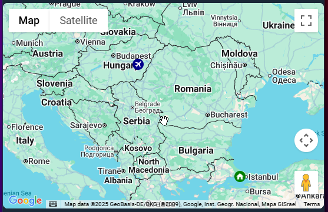

# Google Map Card for Home Assistant

A simple and responsive Lovelace custom card that displays the location of a `person.` entity using the Google Maps JavaScript API

## Features

- Interactive Google Map view
- Dynamic selection of person entities
- Map terrain types
- Street View
- Route tracking
- Custom zoom level
- Fully responsive iframe layout
- No additional dependencies required

## Attention

💡 Google Maps JavaScript API must be enabled in your Google Cloud project. https://console.cloud.google.com/google/maps-apis/api-list


💡 Most of the Google API's have quotas and exceeding limits are charged by Google. However Google Maps JavaScript API is unlimited per day. But to stay on the safe side do not forget to check your monthly quota limits. (not only for this integration but also the others related to Google API's)

Create API and click the show key button on the bottom right


---

## Installation

### Via HACS (Recommended)

1. Go to **HACS > Frontend > Custom Repositories**
2. Add this repository URL:  
   `https://github.com/cataseven/google-map-card`
3. Choose "Lovelace" as the category and click **Add**
4. Find "Google Map Card" in the HACS store and install
5. Make sure it is loaded in `resources:` (HACS should do this automatically)

### Manual

1. Download `google-map-card.js`
2. Place it in `www/community/google-map-card/`
3. Add the following to your Lovelace `resources:` section:

resources:
  - url: /local/community/google-map-card/google-map-card.js
    type: module

## Parameters

| Key        | Type    | Description                                              |
| ---------- | ------- | -------------------------------------------------------- |
| `api_key`  | string  | Your Google Maps Embed API key (required)                |
| `entities` | list    | One or more `person.` entities to select from (required) |
| `zoom`     | integer | Zoom level (1–20) (optional)                             |
| `theme_mode`| string  | light, dark (optional)                                  |
| `icon_size`| integer | (optional)                                               |
| `hours_to_show`| integer | 0 to disable it, default: 4                          |
| `polyline_color`| string  | polyline color for tracking                         |
| `icon_color`| string  | icon color                                              |
| `background_color`| string  | icon background color                             |
## Card Example
```
type: custom:google-map-card
api_key: 123457adasd56a4d78ad
entities:
  - entity: person.animal
    polyline_color: "#FF0000"
    icon_size: 15
    hours_to_show: 2
    icon_color: white
    background_color: darkblue
  - entity: zone.home
    polyline_color: "#0000FF"
    icon_size: 20
    hours_to_show: 3
    icon_color: white
    background_color: green
  - entity: device_tracker.androidphone
    polyline_color: "#0000FF"
    icon_size: 15
    hours_to_show: 0
    icon_color: white
    background_color: green
zoom: 11
theme_mode: light


```

## Screenshot





