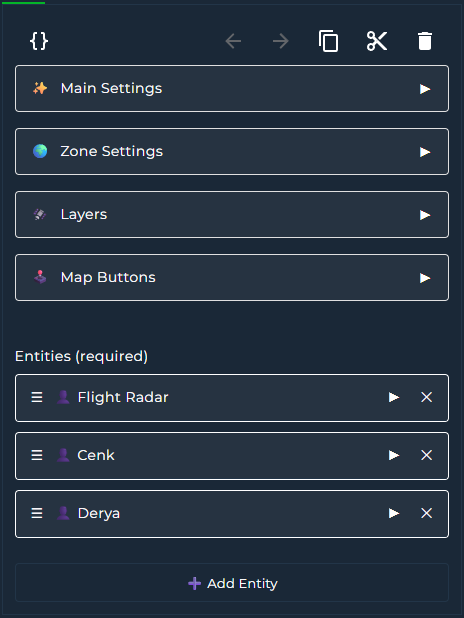
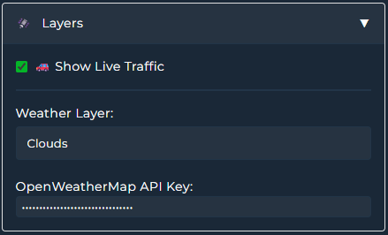
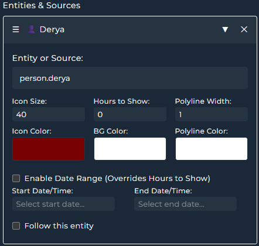

# Google Maps Card for Home Assistant

The BEST MAP CARD EVER! Responsive Lovelace custom card that displays the location of `person.` or `device_tracker.` `sensor.` entities and tracks their routes using the Google Maps JavaScript API.

<br>

# Features
- Live Traffic Info
- Weather Layers (via Open Weather API Key)
- Show Zones 
- Street View  
- Route tracking  
- Themes (40+ built‑in)  
- Interactive Google Map view
- Supporting entitites of FlightRadar24 integration
- Dynamic selection of person/zone/device_tracker entities  
- Map terrain types (Map, Satellite, Hybrid, Terrain)  
- Custom zoom level  
- Fully responsive iframe layout with `aspect_ratio`  
- **Show/hide map controls** (Pan, Zoom, Street View, Fullscreen, Map Type, Rotate)  
- **Control positions of buttons**
- **Scale bar** and **keyboard shortcuts** support  
- **Follow** mode: auto‑center map on selected entity/entities  

  
<br>

# Attention

💡 Google Maps JavaScript API must be enabled in your Google Cloud project:  
https://console.cloud.google.com/google/maps-apis/api-list


# Attention

💡 Most Google APIs have quotas and exceeding limits may incur charges. However Google Maps JavaScript API itself has no daily limit and it is free and unlimited as of August, 2025 until any policy change


However it is good watch your monthly quota to stay on the safe side. Here is the link for quota stats: https://console.cloud.google.com/google/maps-apis/quotas?

If you want to stay on the safe side just set limit and quota alarm for your api. Google can change its policy anytime so also follow policy changes. Also watch this review by @BeardedTinker before creating API. Search web to understand how to limit your API to stay within free-to-use limits
https://youtu.be/usGLOxtXCxA?si=BxDj65bksi_tcZek

Create API key and click the “Show key” button in the console:


---

<br>

# Installation

## Via HACS

1. Go to **HACS**  
2. Search for **Google Map Card**  
3. Download & install  

# Adding the Card to Dashboard

Add via the Lovelace card picker (search “Google Map Card”)  
or define it in YAML (see Card Example below):

<br>


<br>

# UI Card Editor








<br>


# Live Traffic Info by Google Maps
Optional. Real time traffic layer

  

# Live Weather Layer by Open Weather API (Optional)


You need to create api key from openweathermap.org. Please create API v1.0. It is free. Please find the section below and create free API on https://openweathermap.org/price. **DO NOT** create API of One Call API 3.0

API v1.0 is enough and it is free.

 

# Adding Geo Location Sources

If you have any integration providing geo location source, they will be automatically listed on the bottom of entity list.


# Enabling Clustring

If you set clustring on then route history markers will be groupped accordingto zoom zevel. More zoom more granularity. This increases performance on slow systems
  

# Themes

You can choose your best theme—40 now and more to come!  
  


<br>
## 🔧 Parameters

### 🧹 General Options

| Key            | Type    | Description                                                                   |
| -------------- | ------- | ----------------------------------------------------------------------------- |
| `type`         | string  | Required for Home Assistant custom card. Must be `custom:google-map-card`.    |
| `api_key`      | string  | Your Google Maps Embed API key (**required**).                                |
| `zoom`         | integer | Initial zoom level (1–20).                                                    |
| `theme_mode`   | string  | Map theme name from built-in themes (`Dark_Blueish_Night`, etc.).             |
| `aspect_ratio` | string  | Card aspect ratio (`16:9`, `4:3`, `1`, `1:1.56`, `400px`, etc.).              |
| `map_type`     | string  | Map type: `roadmap`, `satellite`, `hybrid`, or `terrain`. Default: `roadmap`. |
| `zoom_type`    | string  | Zoom type: `cooperative` for CTRL+SCROLL, `greedy` for just SCROLL, `auto` |
| `marker_clustring`     | boolean  | If `true`, route history markers will be groupped depending on zoom level. Increases performance for slow systems. |
| `proximity_clustering`     | boolean  | If `true`, entities within the defined radius will be groupped until zoom level is higher than 17 |
| `proximity_radius`     | number  | Radius of proximity cluster default: 150 |
| `spiderfy`     | boolean  | If `true`, after some zoom level, icons of entities with exact loction will seperated by some distance in order to see all icons |

### 👤 Entities

| Key                | Type    | Description                                                                                                          |
| ------------------ | ------- | -------------------------------------------------------------------------------------------------------------------- |
| `entities`         | list    | A list of `device_tracker`, `person`, or `zone` entities to show on the map (**required if no geo location sources provided**).                          |
| `entity`           | string  | Entity ID to track.                                                                                                  |
| `icon_size`        | integer | Size of the icon for this entity.                                                                                    |
| `icon_color`       | string  | Icon color (e.g., `#ffffff`).                                                                                        |
| `background_color` | string  | Background color of the icon.                                                                                        |
| `hours_to_show`    | integer | Number of hours of location history to show. Use `0` to disable history.                                             |
| `polyline_color`   | string  | Color of the polyline for route history.                                                                             |
| `polyline_width`   | integer | Width of the polyline for route history.                                                                             |
| `follow`           | boolean | If `true`, map will center on this entity. When multiple entities have `follow: true`, the map will fit all of them. |
| `show_history_dots`           | boolean | If `true`, location history dots is not rendered. May increase speed of map rendering for long time period data. |
| `history_start_date`           | string | Date range start date for history tracking. Overrides `hours_to_show` |
| `history_end_date`           | string | Date range start date for history tracking. Overrides `hours_to_show`|
        

### 👤 Geo Location Sources

| Key                | Type    | Description                                                                                                          |
| ------------------ | ------- | -------------------------------------------------------------------------------------------------------------------- |
| `geo_location_sources`         | list    | Geo Location Sources listed in entity selection list (**required if no entity provided**).                          |

### 🕹️ Map Buttons

| Key                 | Type    | Description                                                                                     |
| ------------------- | ------- | ----------------------------------------------------------------------------------------------- |
| `cameraControl`     | boolean | Show or hide pan control.                                                                       |
| `zoomControl`       | boolean | Show or hide zoom control.                                                                      |
| `streetViewControl` | boolean | Show or hide Street View control.                                                               |
| `fullscreenControl` | boolean | Show or hide fullscreen control.                                                                |
| `mapTypeControl`    | boolean | Show or hide map type selector.                                                                 |
| `rotateControl`     | boolean | Show or hide rotate/tilt control. Only works in some cities or zoom levels (Google limitation). |
| `showScale`         | boolean | Show or hide the scale bar.                                                                     |
| `keyboardShortcuts` | boolean | Enable or disable keyboard shortcuts for navigation.                                            |
| `show_traffic_button`| boolean | Show or hide Traffic Layer Toggle Button.                                                      |
| `show_weather_button` | boolean | Show or hide Weather Layer dropdown menu.                                                     |
| `show_datepicker_button` | boolean | Show or hide Calendar. (Date Range should be enabled for at least one entity               |
| `show_recenter_button` | boolean | Show or hide Recenter Map Button.                                                            |
| `buttons_opacity` | float | Opacity of all buttons on the map. Buttons will be solid when hover                                 |

### 📚 Layers

| Key                 | Type    | Description                                                                                     |
| ------------------- | ------- | ----------------------------------------------------------------------------------------------- |
| `show_traffic`      | boolean | Show or hide live traffic. No extra api key needed                                               |
| `weather_layer`     |string | Add weather layer. `none`, `precipitation_new`, `pressure_new`, `wind_new`, `temp_new`, `clouds_new` |
| `owm_api_key` | string | Create api and restrict it 1000 per day https://home.openweathermap.org/api_keys                       |


### 🔝 Button Positions

| Key                          | Type   | Description                                         |
| ---------------------------- | ------ | --------------------------------------------------- |
| `cameraControl_position`     | string | Position of the pan control (e.g., `RIGHT_BOTTOM`). |
| `zoomControl_position`       | string | Position of the zoom control.                       |
| `streetViewControl_position` | string | Position of the Street View control.                |
| `fullscreenControl_position` | string | Position of the fullscreen control.                 |
| `mapTypeControl_position`    | string | Position of the map type selector.                  |
| `rotateControl_position`     | string | Position of the rotate/tilt control.                |
| `show_traffic_button_position`    | string | Position of the traffic layer toggle button    |
| `show_weather_button_position`     | string | Position of the weather layer dropdown menu   |
| `show_recenter_button_position`     | string | Position of the recenter map button   |
| `show_datepicker_button_position`     | string | Position of the calendar   |

### 🎯 Zones

| Key       | Type    | Description                                               |
| --------- | ------- | --------------------------------------------------------- |
| `zones`   | object  | Defines `zone` entities to show on the map, with styling. |
| `show`    | boolean | Whether to display the zone or not.                       |
| `color`   | string  | Fill color for the zone area (e.g., `#3498db`).           |
| `opacity` | float   | Opacity for the zone fill color (0.0 to 1.0).             |
| `follow`  | boolean | Centre the map                                            |


**The following control positions are supported:** 

`TOP_LEFT`, `TOP_CENTER`, `TOP_RIGHT`,  
`LEFT_TOP`, `LEFT_CENTER`, `LEFT_BOTTOM`,  
`RIGHT_TOP`, `RIGHT_CENTER`, `RIGHT_BOTTOM`,  
`BOTTOM_LEFT`, `BOTTOM_CENTER`, `BOTTOM_RIGHT`

| Position         | Description                                                                                                           |
|------------------|-----------------------------------------------------------------------------------------------------------------------|
| `TOP_CENTER`     | Control placed along the top center of the map.                                                                       |
| `TOP_LEFT`       | Control placed along the top left of the map, with sub‑elements “flowing” toward the top center.                      |
| `TOP_RIGHT`      | Control placed along the top right of the map, with sub‑elements “flowing” toward the top center.                     |
| `LEFT_TOP`       | Control placed along the top left of the map, but below any `TOP_LEFT` elements.                                      |
| `RIGHT_TOP`      | Control placed along the top right of the map, but below any `TOP_RIGHT` elements.                                    |
| `LEFT_CENTER`    | Control placed along the left side of the map, centered between `TOP_LEFT` and `BOTTOM_LEFT`.                         |
| `RIGHT_CENTER`   | Control placed along the right side of the map, centered between `TOP_RIGHT` and `BOTTOM_RIGHT`.                      |
| `LEFT_BOTTOM`    | Control placed along the bottom left of the map, but above any `BOTTOM_LEFT` elements.                                |
| `RIGHT_BOTTOM`   | Control placed along the bottom right of the map, but above any `BOTTOM_RIGHT` elements.                              |
| `BOTTOM_CENTER`  | Control placed along the bottom center of the map.                                                                    |
| `BOTTOM_LEFT`    | Control placed along the bottom left of the map, with sub‑elements “flowing” toward the bottom center.                |
| `BOTTOM_RIGHT`   | Control placed along the bottom right of the map, with sub‑elements “flowing” toward the bottom center.               |

<br>
# Card Example

```yaml
type: custom:google-map-card
api_key: <<GOOGLE API KEY>>
owm_api_key: <<OPEN WEATHER API KEY>>
theme_mode: Dark_Blueish_Night
map_type: roadmap
zoom: 16
aspect_ratio: 1.53:1
weather_layer: clouds_new
proximity_clustering: true
proximity_radius: 5
marker_clustering: false
gesture_handling: greedy
camera_control: false
zoom_control: false
zoom_control_position: RIGHT_BOTTOM
street_view_control: false
street_view_control_position: LEFT_BOTTOM
fullscreen_control: false
fullscreen_control_position: RIGHT_TOP
map_type_control: false
map_type_control_position: TOP_LEFT
map_type_control_style: DROPDOWN_MENU
rotate_control: false
pan_control: true
show_scale: false
scaleControlPosition: BOTTOM_LEFT
keyboard_shortcuts: false
show_traffic_button: true
show_traffic_button_position: TOP_RIGHT
show_weather_button: true
show_weather_button_position: TOP_RIGHT
show_recenter_button: true
show_recenter_button_position: LEFT_BOTTOM
show_datepicker_button: true
show_datepicker_button_position: TOP_CENTER
show_traffic: false
show_history_dots: true
entities:
  - entity: device_tracker.flightradar24
    icon_size: 30
    hours_to_show: 10
    polyline_color: "#ffffff"
    polyline_width: 1
    icon_color: "#780202"
    background_color: "#ffffff"
  - entity: person.cenk
    icon_size: 30
    hours_to_show: 0
    polyline_color: "#ffffff"
    polyline_width: 1
    icon_color: "#780202"
    background_color: "#ffffff"
    history_start_date: "2025-08-12T09:00:00.000Z"
    history_end_date: "2025-08-13T09:00:00.000Z"
  - entity: person.derya
    icon_size: 30
    hours_to_show: 0
    polyline_color: "#ffffff"
    polyline_width: 1
    icon_color: "#780202"
    background_color: "#ffffff"
    history_start_date: "2025-08-12T09:00:00.000Z"
    history_end_date: "2025-08-13T09:00:00.000Z"
zones:
  zone.work:
    show: false
    color: "#3498db"
    follow: false
    label_color: "#c4dbf9"
  zone.work_2:
    show: false
    color: "#3498db"
    follow: false
    label_color: "#c4dbf9"
  zone.home:
    show: true
    color: "#3498db"
    follow: false
    label_color: "#c4dbf9"
```

# Screenshots

  
  


## ⭐ Support
If you like this card, feel free to ⭐ star the project on GitHub and share it with the Home Assistant community!
